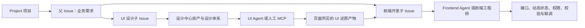
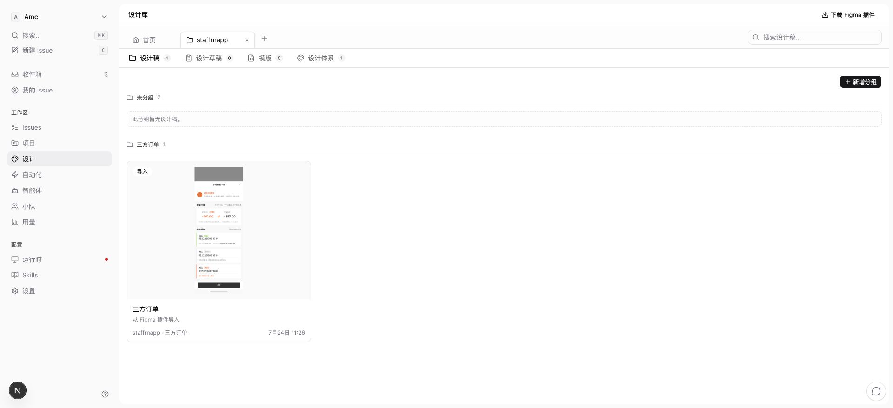
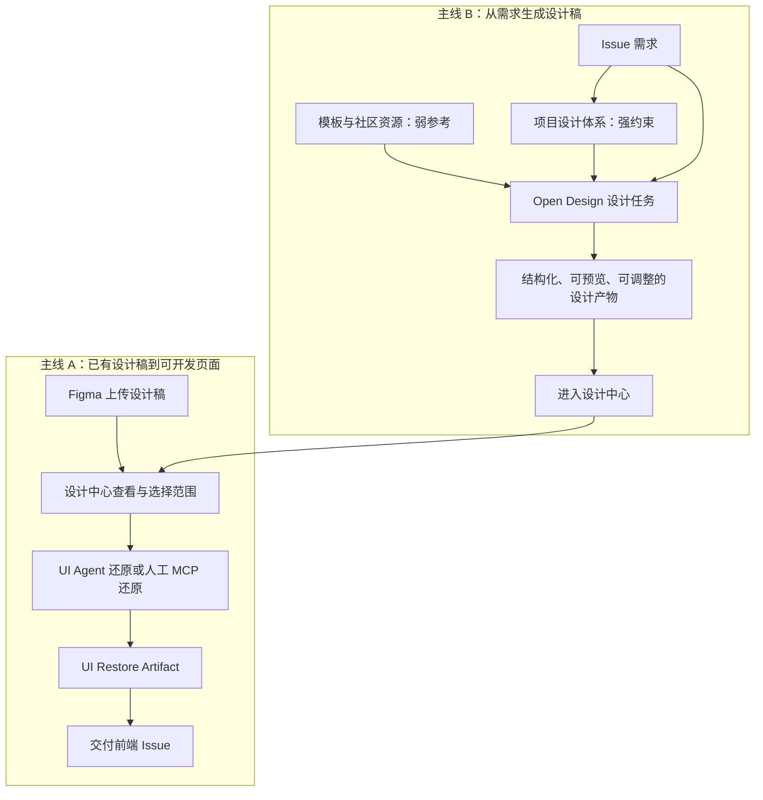
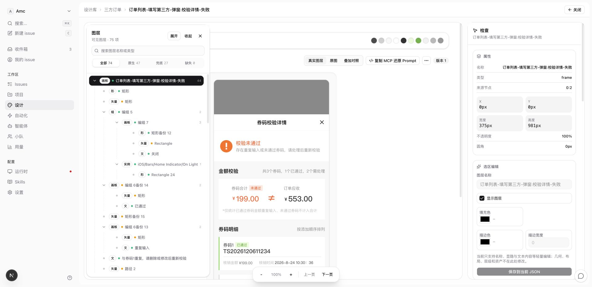
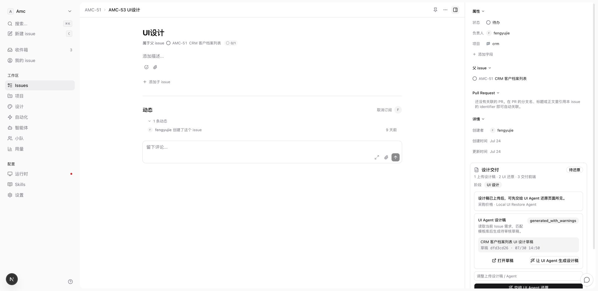
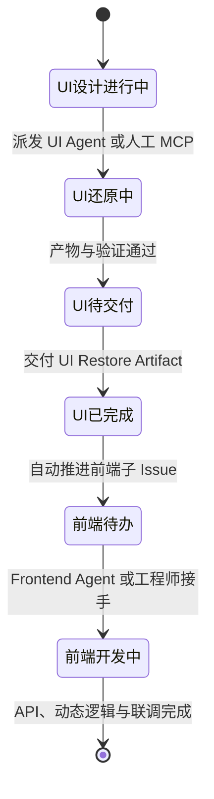
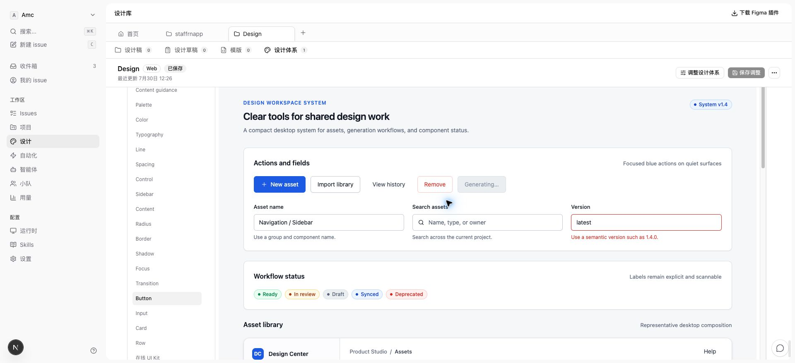
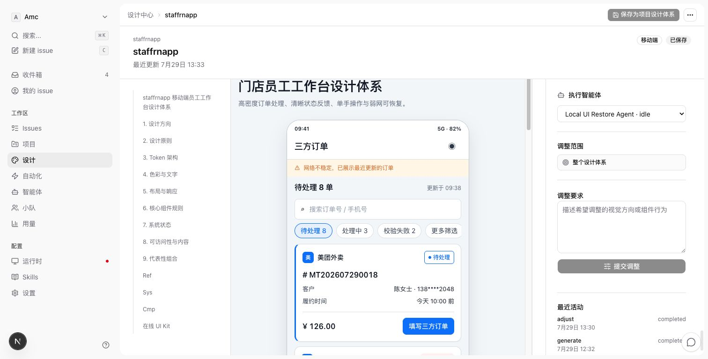
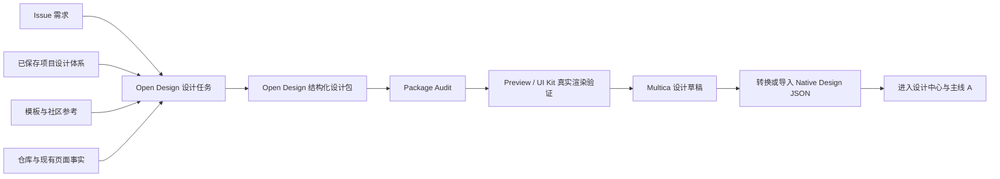
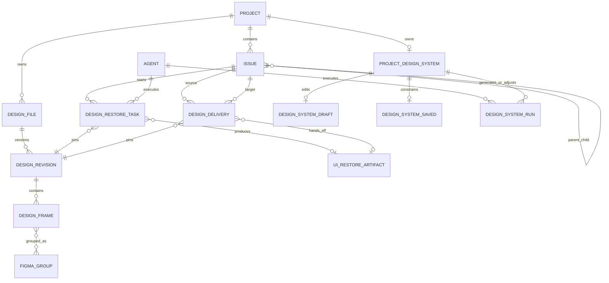

# Multica 设计中心与 Issue 设计链路总览

> 文档状态：历史阶段总览（截至 2026-08-03；不是当前决策源）
>
> 截止日期：2026-08-03
>
> 覆盖范围：Figma 插件、设计中心、Native Design Viewer、设计 MCP、Issue 设计交付、UI Agent 设计还原、Frontend Agent 接入、模板、UI 规范、项目设计体系、Open Design、未来首页与社区资源
>
> 当前产品方向与实施边界以同目录 `README.md` 为准。本文中“直接采用 Open Design Worker/Runtime”等结论已于 2026-08-05 被原生设计引擎方向替代，仅用于解释历史演进。

## 1. 文档定位

这份文档回答四个问题：

1. Multica 的设计能力为什么存在，它在完整需求交付流水线中处于什么位置；
2. 从 Figma 上传到 UI 还原、再到前端开发交付的第一条产品线已经做到什么程度；
3. 从模板和 UI 规范生成设计稿、再转向 Open Design 项目设计体系的第二条产品线经历了什么，为什么发生方向调整；
4. 当前哪些能力已经完成，哪些只是实验验证，哪些已经暂停或被替代，下一步如何继续。

本文按照决策发生时间和当前代码事实整理。历史方案只用于解释演进原因，不会覆盖 2026-07-28 之后已经确认的设计体系与 Open Design 方向。

状态统一使用以下词汇：

| 状态 | 含义 |
| --- | --- |
| **已完成** | 已进入当前产品或代码主路径，并有可运行能力 |
| **已验证但未生产接入** | 已通过真实实验证明可行，但还没有接入正式产品闭环 |
| **部分完成** | 主体能力存在，但关键闭环、边界或体验仍缺失 |
| **待完成** | 已确认需要建设，但尚未实现 |
| **已暂停** | 当前停止扩展，保留可复用经验或局部代码 |
| **已替代** | 曾经是目标，现已被更新方案取代，不应继续作为新开发依据 |

## 2. Multica 的设计能力处于什么位置

Multica 的目标不是单独做一个 Figma 查看器，也不是单独做一个 AI 设计工具。它以 Project 和 Issue 为主控制面，让人、云端 Agent 和本地 Agent 在一条可追踪的需求流水线中共同工作。

设计中心负责提供设计资产和设计上下文，Issue 负责表达任务、责任人、状态和交付关系，Agent 负责在明确输入与产物契约下执行。



这套职责边界在 2026-07-02 被明确修正为：

- **UI 设计师 / UI Agent** 负责“页面所见”：页面结构、布局、组件、样式、响应式、静态交互、弹窗和 mock 状态；
- **前端工程师 / Frontend Agent** 负责“页面可用”：API、真实数据、动态状态、权限、校验、异常处理和业务联调；
- **设计中心** 负责保存、组织和提供可固定引用的设计输入；
- **Issue** 负责把输入、执行、产物和下游任务连接起来。

## 3. 当前设计中心的信息架构

设计中心目前以项目为工作空间组织资产：

- 顶部固定保留不可关闭的“首页” Tab；
- 用户打开的项目成为可切换、可关闭的项目 Tab；
- 项目内使用紧凑内容 Tab：`设计稿 / 设计草稿 / 模版 / 设计体系`；
- 设计中心右上角提供 Figma 插件下载；
- 首页当前为空，留给下一阶段的设计任务发起、最近工作与社区资源。



> 当前页面已经建立“首页 + 多项目工作区 + 项目内容 Tab”的外壳。首页内容和社区资源仍待完成。

## 4. 两条产品主线

设计模块不是一条单线，而是两条最终会汇合的主线。



- **主线 A** 解决“已经有设计稿，如何高质量地还原进真实工程”；
- **主线 B** 解决“只有需求和项目资产，如何生成可信、可调整、符合项目的设计稿”；
- 两条线在设计中心汇合。无论设计来自 Figma、人类设计师、UI Agent 还是社区模板，最终都应成为统一的设计资产，并沿主线 A 进入实现和交付。

## 5. 时间线与决策演进

### 5.1 2026-06-29 至 2026-06-30：Figma 导入与 Native Viewer 地基

这一阶段先解决最基础的问题：Multica 必须能接收真实 Figma 结构，而不是只保存一张截图。

完成内容：

- Figma 插件读取 frame、group、layer、文字、形状、图片与导出资产；
- 设计文件和 revision 进入 Server；
- Native Viewer 以真实图层为主体渲染；
- 原始预览图作为视觉对照和兼容资源保留；
- 支持图层树、属性查看、轻量编辑和叠加对照；
- restore task 与 `file_id + revision_id` 固定关联，避免设计更新后错误复用旧任务。

这一阶段形成了一个重要边界：Native Viewer 不是在线 Figma；整图 preview 可以用于查看、对照和调试，但不能冒充最终代码还原结果。

### 5.2 2026-07-01：原始 Design Delivery MVP

最初实现的流程是：UI Issue 选择设计稿，直接交付给前端 Issue，由前端承担全部还原与业务开发。

这套实现建立了 `design_delivery` 的数据基础，包括来源 Issue、目标 Issue、固定 revision、scope、状态和审计信息，但职责分配不符合真实团队协作，因此第二天被修正。

当前结论：原始设计稿直交前端只作为内部降级兼容路径，不是主流程。

### 5.3 2026-07-02：确立 UI Restore First

这一阶段明确：UI 设计 Issue 在完成视觉页面还原以前，不能把工作提前推给前端。

正确主流程变为：

```text
Figma 上传
  -> UI 设计 Issue 选择设计范围
  -> UI Agent 还原，或 UI 负责人通过 MCP 自行还原
  -> 形成 UI Restore Artifact
  -> UI Issue 完成并交付前端子 Issue
  -> 前端补充 API、动态状态和联调
```

Issue 侧步骤文案也被统一为：

```text
1 上传设计稿 · 2 UI 还原 · 3 交付前端
```

### 5.4 2026-07-03 至 2026-07-07：分组语义、页面关系与 MCP

真实 Figma 文件中，一个业务页面通常包含默认态、加载态、弹窗、结果态等多个画板。若 Agent 把每个画板理解为一个独立页面，容易生成错误的路由或一组无意义的 Tab。

因此确定了轻量命名规则：

- `钱包首页 - 已绑定支付宝`
- `钱包首页 - 未绑定支付宝`
- `提现 - 弹窗：确认提现`
- `提现 - 结果：申请已提交`

规则含义：

- ` - ` 左侧是所属业务页面；
- 右侧是该页面的状态、场景、弹窗或结果态；
- 同一个 Figma Group 优先表达一个业务页面的多状态集合；
- Group 能整体交付，但单个画板仍然必须可以独立还原，不能因分组而失去精细选择能力。

同时建设了设计 MCP，使真实工程师可以在 Codex 等本地 Agent 中读取设计范围并自行还原。

### 5.5 2026-07-08 至 2026-07-14：模板与 Figma UI 规范 Profile

为了让 UI Agent 更懂项目风格，Figma 插件扩展为三类上传：

1. `业务设计稿`
2. `模板资产`
3. `UI 规范`

UI 规范曾采用 `组件 - 变体 - 状态` 命名，例如：

- `按钮 - 主按钮 - 默认`
- `按钮 - 主按钮 - 禁用`
- `输入框 - 错误`
- `标签 - 成功`
- `表格 - 标准表格`

Server 将这些内容分析成 `design_system_profile`，包括颜色、字体、组件变体、状态、示例和规则。这个阶段证明了“设计资产需要被编译成 Agent 可读约束”，但后续也暴露出两点问题：

- 依赖有限的组件字典和名称分类，无法自然覆盖抽屉、Popover 等无限扩展的组件语义；
- Figma UI 规范被误当成建立项目设计体系的前置条件，产品方向过窄。

当前结论：该 Profile 是历史实现和可迁移输入，不再是项目设计体系的最终事实源。

### 5.6 2026-07-21 至 2026-07-27：PageSpec、Blueprint 与 DesignCompiler

最早的设计稿生成方式是直接让 Agent 修改模板 JSON。CRM 列表页实验中出现了明显问题：

- 只替换第一个筛选项，旧模板筛选仍残留；
- 表头新增了需求列，但旧表头没有被删除；
- 只修改第一行数据，其余行仍是模板内容；
- 页面产生文本重叠、结构残留和布局错误；
- 任务显示完成或草稿存在，但视觉结果没有真正变化。

根因不是单纯“提示词不够长”，而是原始 Figma JSON 适合表达图层，不适合表达业务页面的增删改意图。为此建立了中间语义层：

```text
Issue PRD
  -> UI Agent 生成 PageSpec
  + Template Blueprint
  + ComponentRecipe / UI Profile
  -> DesignCompiler
  -> Native Design JSON
  -> Quality Gate
```

该路线实现了筛选区、操作区、表格、状态标签、行操作和分页等 B 端列表页基础能力，并积累了需求覆盖、模板残留检测和草稿质量门禁经验。

但是它逐渐变成一套 Multica 自研的页面 DSL 和渲染编译器。它可以改善标准 B 端列表页，却无法自然覆盖复杂 B 端页面、C 端页面和自由布局，也不能让 UI Agent 真正像设计师一样工作。

当前状态：**已暂停**。保留质量门禁、需求覆盖和模板残留检查经验，不再把 PageSpec 编译器当作通用 UI 设计主引擎。

### 5.7 2026-07-28 至 2026-07-31：项目设计体系与 Open Design 转向

这一阶段重新定义了源头：

- 项目设计体系是项目设计事实源；
- Figma UI 规范只是可选输入证据，未来也可以由设计体系反向派生；
- 模板是弱参考，不是必须照抄的骨架；
- UI Agent 可以自由设计布局，但必须受到项目设计体系的强约束；
- Multica 不再自研 Open Design 的包、Token、提取、Audit 和 Preview 等价实现，直接采用 Open Design 上游能力；
- Multica 继续拥有 Project、Issue、Agent、权限、云存储和设计中心控制面。

项目设计体系的第一阶段用户流程被确认为：


产品语言不引入“待审核、通过、驳回”等审核状态。草稿只是尚未保存的编辑过程，拥有项目编辑权限的用户可以预览、调整、保存或放弃。

### 5.8 2026-07-31 至 2026-08-03：Open Design Phase 0 验证

Open Design 第一接入基线固定为：

- Release：`open-design-v0.16.1`
- commit：`276b4d8e970bc143d7ad060181a89a834e3d9caf`

`OD-021` 至 `OD-027` 已通过真实实验确认：

- 固定版本 headless worker 可以构建、启动和停止；
- Multica 选择的真实 Agent 可以在隔离 scratch 中创建和调整设计体系；
- 可以获得真实事件、result package、完整设计体系包和 digest；
- Open Design Package Audit 可以验证好包并拒绝坏包；
- Chrome Preview 可以验证 UI Kit 是否真正可见；
- 取消、Agent 失败、Audit 失败和 Preview 失败可以被分别复现；
- Open Design 和 Agent 只修改 scratch，源仓库保持零写入；
- scratch 可以在证据归档后回收。

但是 Phase 0 当前仍是 **No-Go**：这些能力主要由实验脚本串联，尚未成为 Multica 可恢复、可持久化、可查询的正式 supervisor。不能因为实验成功就把结果自动写入设计体系草稿，更不能替换当前主流程。

## 6. 主线 A：Figma 到 UI 还原，再到前端交付

### 6.1 前置业务结构

以“服务记录开发”为例：

```text
父 Issue：服务记录开发
  ├─ 子 Issue A：UI 设计，负责人为 UI 设计师或 UI Agent
  └─ 子 Issue B：前端开发，负责人为前端工程师或 Frontend Agent
```

每个 Issue 可以关联：

- 一个 Project；
- 一个负责人；
- 一个父 Issue；
- 自己的状态、描述、附件和活动记录。

Project 则可以关联本地仓库、Git 仓库或其他 Agent 可访问资源。UI 还原要进入真实工程时，所选 Agent 必须能访问对应项目资源。

### 6.2 Figma 插件：设计资产入口

#### 上传对象

插件当前支持：

- 业务设计稿；
- 模板资产；
- Figma UI 规范；
- 当前页面、选中的画板或分组；
- 图层结构、文本、样式、图片填充和导出资产。

#### 分组与单画板

上传 Group 时，插件不会把整个 Group 永久压扁成一张画板，而是：

- 提取 Group 内真实子画板；
- 保存画板之间的 Figma 分组关系；
- 在设计中心按组展示；
- 同时保留单画板详情和单画板还原能力。

这使“整组理解一个业务页面”和“单独还原某个状态”可以同时成立。

#### 噪音与资源处理

当前采用的是克制的噪音处理，而不是试图猜测并删除所有可疑节点：

- 设计师在 Figma 中隐藏的节点不上传；
- 不可见 paint、effect 和隐藏 instance 子节点不上传；
- 可见图层中已经存在的图片或导出资产优先保留，Agent 不应重新手绘；
- 资源逐个上传并等待 ack，避免大文件一次塞入导致插件超时或内存异常；
- 未成功上传的资源引用在最终导入前移除，避免产生空 URL；
- 当前静态资源接入七牛，前端直接消费 CDN URL，默认域名为 `https://static.soyoung.com`。

这套边界的原则是：清除明确垃圾，保留设计事实，不把“噪音分析”做成新的错误来源。

### 6.3 设计中心：设计资产工作区

业务设计稿进入项目的“设计稿” Tab 后，用户可以：

- 按 Figma Group 查看同一业务页面的多状态集合；
- 打开分组中的具体画板；
- 独立打开未分组画板；
- 固定查看某一个 revision；
- 从画板、分组、选中图层或框选范围复制 MCP Prompt；
- 在详情页检查真实图层、原图和叠加对照。



#### 三种查看方式的职责

| 模式 | 作用 | 是否可作为最终还原结果 |
| --- | --- | --- |
| 真实图层 | 查看 Multica 解析后的文字、形状、图片、层级和属性 | 是 Agent 结构理解的主要输入，但不是直接代码 |
| 原图 | 查看 Figma 上传时的视觉基准 | 只能作为对照，不能整图塞进页面冒充还原 |
| 叠加对照 | 比较真实图层渲染与原始视觉差异 | 用于质量检查，不是交付物 |

Native Viewer 当前支持文字、图片、形状、矢量或 fallback 资产、图层树、属性检查和一部分轻量编辑。它仍不是完整 Figma，复杂矢量、特殊效果和部分内容可能依赖 fallback asset。

### 6.4 人工 MCP 还原

人工 MCP 路线服务于真实 UI 工程师或前端工程师：用户不必把任务派给 Multica Agent，可以在本地 Codex 等工具中直接读取设计上下文并实现。

#### MCP 的部署形态

无论 Multica Server 在本地还是云端，MCP 进程都运行在工程师本机：

```text
本地 Codex / Agent
  -> 本机 multica CLI 的 MCP Server
  -> 本地持久登录配置
  -> 本地或云端 Multica API
  -> 设计 revision、scope 和 Restore Pack
```

云端部署后，不需要把 MCP 进程部署到设计师电脑以外的神秘位置。工程师安装 `multica` CLI，把 CLI 的 `server_url` 指向云端，再在 Codex 的 `mcpServers` 中配置本机 CLI 即可。

#### 可选范围

MCP scope 当前覆盖：

| scope | 用途 |
| --- | --- |
| `frame` | 只还原一个画板或页面状态 |
| `figma_group` | 将一个 Figma Group 作为同一业务页面的多状态集合还原 |
| `selected_layers` | 只读取用户多选的图层 |
| `selection_bounds` | 读取框选区域以及与区域相交的图层 |

分组 scope 会明确告诉 Agent：这些画板是一个业务页面的状态、弹窗和结果态，不要自动做成多个互不相关的页面，也不要做成展示所有状态的 Tab 页面。

单画板 scope 始终保留，避免“有了 Group 就不能单独还原一页”的错误。

#### Restore Pack

设计 MCP 不把整份 Figma 原始 JSON 一股脑扔给 Agent，而是提供整理后的 Restore Pack：

- scope 身份、file 和 revision；
- 页面、状态、弹窗和结果态关系；
- 画板尺寸和所选图层；
- 核心文本、颜色、字体、间距和组件线索；
- 可见图片与导出资产；
- 已过滤的隐藏层；
- 输入框、选择器等交互提示；
- 整图 preview 禁用规则；
- 项目设计上下文和还原要求。

主要 MCP 工具包括：

- `multica_design_get_restore_pack`
- `multica_design_list_files`
- `multica_design_list_frames`
- `multica_design_list_groups`
- `multica_design_get_selection_context`
- `multica_design_get_ui_restore_artifact`

其中 `list_groups` 当前仍主要引导用户从设计中心复制带 group scope 的 Prompt，服务端完整 group listing 仍需补齐。

#### 当前闭环缺口

人工 MCP 已经可以读取范围并在本地仓库完成代码，但“人工完成后自动回写为 UI Restore Artifact，并解锁同一套 Issue 交付状态”还没有形成完整产品闭环。这是主线 A 剩余的重要缺口之一。

### 6.5 Issue 内派发 UI Agent 还原

UI 设计 Issue 右侧“设计交付”区是 Agent 还原入口。



用户选择设计稿、revision、画板或分组，并选择 Agent 后，Server 创建 Restore Plan 和 Agent task。

#### Agent 收到的工程上下文

Restore Plan 会尽量让 Agent 像正常程序员一样进入真实工程，而不是生成孤立 demo：

- 读取 Issue、本 Issue 的父 Issue 和项目上下文；
- 获取 Project 绑定的本地仓库或 Git 资源；
- 在已有仓库分析可用时识别技术栈、路由、页面目录、组件目录、样式和现有组件库；
- 根据父 Issue 推断业务模块名；
- 优先使用 `business_module` 方式，在项目正常 `views/pages`、`components` 和 router 中实现；
- 只有无法获得仓库结构时才降级到 sandbox prototype；
- 不允许用 restore task id 作为长期业务模块名；
- 不允许把多个真实业务页面错误合并成一个 query/tab 展示页。

#### 还原约束

Agent Prompt 当前明确要求：

- 以真实图层和 Restore Pack 为结构输入；
- 以原图和叠加对照为视觉验证输入；
- 禁止用整张 preview、thumbnail 或 full-frame slice 代替页面实现；
- 可见 layer 已有图片资产时优先渲染该资产，不重复绘制；
- `请选择`、`请输入` 等控件应使用当前项目的组件和交互模式；
- 同一页面的状态、弹窗和结果态要建立实际交互关系；
- 页面间应使用项目路由和业务入口建立关联；
- 完成声明必须包含结构化结果，不能只说“已完成”。

#### UI Restore Artifact 文档

UI Agent 必须在目标仓库输出：

```text
docs/multica/ui-restore/<restore-task-id>.md
```

文档至少包含：

- 入口路由；
- 修改文件；
- 页面、状态和弹窗关系；
- 设计节点到代码的 restore mapping；
- 已完成检查；
- 未解决阻塞；
- 前端集成说明。

Agent 同时在 `RESTORE_RESULT_JSON.artifactDocPath` 返回该路径。这个文档是 UI Agent 与 Frontend Agent 的工程交接面，不需要在普通用户页面增加额外理解成本。

### 6.6 UI Issue 到前端 Issue 的交付

UI 还原完成后，UI Issue 才进入前端交付阶段。



交付事实由 `design_delivery` 记录：

- 来源 UI Issue 和目标前端 Issue；
- 设计 file 与固定 revision；
- frame/group/selection scope；
- `ui_restore_artifact` 或内部 raw fallback 类型；
- 关联 restore task；
- active、superseded、cancelled 生命周期；
- 发起人、取消人、时间、原因与审计元数据。

一条 UI Issue 同时只保留一个当前有效交付。重新交付会覆盖旧 active 记录，但历史仍可追踪。有效交付创建后，目标前端 Issue 可以从 `backlog` 推进到 `todo`；UI Issue 合法完成后，符合条件的前端兄弟 Issue 也会被推进。

Frontend Agent 接手时必须先读取 UI Restore Artifact 文档，再处理：

- API 请求与数据模型；
- 页面动态状态；
- 权限与路由守卫；
- 表单校验与异常反馈；
- 与后端及其他模块联调。

它不应该重新猜测页面视觉结构，也不应该无理由推翻 UI Agent 已交付的组件和样式。

### 6.7 隐藏降级策略

当 UI Agent 或人工 MCP 还原暂时不可用时，系统保留内部降级：

```text
UI 设计师只交付原始 design revision
  -> scope 标记 raw_design_revision
  -> fallback_policy 标记 frontend_full_restore_fallback
  -> 前端承担视觉还原和动态开发
```

这条策略只用于兼容和兜底：

- 页面不增加“请选择工作模式”之类的复杂选项；
- 普通主流程仍然是 UI 先完成还原；
- raw design 交付必须带明确内部标记；
- 不能把普通 active delivery 误判为已完成 UI 还原。

## 7. 主线 B：从模板与 UI 规范到 Open Design 设计体系

### 7.1 最初目标

第二条线的目标一直是让 UI Agent 成为真正的设计师，而不是模板文本替换器：

- 能阅读 Issue 中的需求；
- 能理解项目品牌、视觉规范、组件和已有工程；
- 有相似模板时快速借鉴；
- 没有合适模板时能够按设计原则自由设计；
- 生成的设计稿可以进入设计中心，被人查看、调整、保存和继续还原。

已确认的约束关系是：

| 输入 | 约束强度 | 作用 |
| --- | --- | --- |
| 项目设计体系 | 强约束 | 颜色、字体、间距、组件、状态、设计原则和品牌一致性 |
| Issue 需求 | 强约束 | 业务目标、信息结构、字段、流程和验收范围 |
| 相似模板 | 弱约束 | 提供布局、组合模式和成熟案例，不要求照抄 |
| 社区资源 | 弱参考 | 扩展可借鉴设计模式和组件资源 |
| UI Agent 判断 | 受约束的自由 | 在满足需求和设计体系前提下选择布局与表达方式 |

### 7.2 为什么不继续用模板 JSON Patch

“复制一个模板 JSON，再改文字和字段”只适合需求与模板几乎完全相同的情况。一旦需要增删区域、改变结构或设计新页面，它会出现：

- 无法判断哪些旧图层应该删除；
- 只更新部分重复行或重复组件；
- 依赖 Figma layer id 和嵌套结构，变更极其脆弱；
- 模板越复杂，残留越多；
- 模板越精简，能表达的页面越少；
- 为每一种复杂页面维护专用编译器，系统会快速膨胀。

因此模板不再承担“确定页面结构”的职责，而是变成可选择的设计参考。

### 7.3 PageSpec 路线保留什么

虽然 PageSpec 编译路线已暂停，但以下经验仍然有效，并应进入未来 Open Design 生成质量门禁：

1. **需求覆盖检查**：Issue 要求的筛选项、字段、状态和操作是否全部出现；
2. **模板残留检查**：设计中是否还存在与需求无关的旧字段、旧文案和旧数据；
3. **布局质量检查**：是否存在文字溢出、异常重叠、越界和空白区域；
4. **组件一致性检查**：是否使用项目设计体系中的正确组件与状态；
5. **真实视觉验证**：不能只验证 JSON 可解析，必须渲染并检查页面确实变化；
6. **坏草稿隔离**：task completed、Agent 自评和文件存在都不能自动让草稿可用。

未来不应继续维护一个越来越大的页面 DSL，但可以把这些检查作为生成后验证器。

### 7.4 项目设计体系成为源

当前确认的设计上下文优先级是：

```text
云端已保存的项目设计体系
  > 本地仓库已有 DESIGN.md
  > 仓库真实样式、全局 CSS、组件库与页面模式
```

含义是：

- Multica 不负责在本地仓库生成或 patch `DESIGN.md`；
- 云端和本地保持各自边界；
- 云端有已保存设计体系时，它是 Agent 的主约束；
- 云端没有时，本地 Agent 可以读取已有 `DESIGN.md`；
- 两者都没有时，Agent 仍要观察仓库实际组件和样式，不能凭空设计；
- 草稿不能作为下游强约束，只有用户保存后的体系才可以被消费。

### 7.5 当前项目设计体系工作区

当前设计中心“设计体系” Tab 已完成一轮产品工作区建设：

- 空项目可以由用户主动创建设计体系；
- 目标平台和执行 Agent 必选；
- 项目定位、目标用户、核心场景、期望风格以自然语言输入；
- Logo、品牌色、截图、Figma UI 规范和参考设计是可选资料；
- 用户可以主动让 Agent 对项目仓库做只读分析；
- 分析期间页面锁定，只保留停止操作，避免输入在分析中途发生漂移；
- 分析成功后，参考资料收起为只读摘要，并自动用于生成；
- 用户重新选择资料后必须重新分析，旧分析不能静默复用；
- 草稿和已保存体系共用连续内容主视图；
- 页面展示具体规则、Tokens、组件状态、页面模式和在线 UI Kit，不展示文件树；
- Agent 调整面板按需打开，可以全局调整，也可以针对章节或组件调整；
- 不引入审核状态，用户直接保存、继续调整或放弃草稿。





这部分 UI 和交互闭环已经经过真实页面、API 和持久化验证。但当前后端的固定三文件生成与自定义解析只是阶段性实现，不能代表最终 Open Design 引擎已经接入。

### 7.6 Open Design 的目标边界

Multica 直接采用 Open Design 的以下能力语义：

- 多来源导入与来源证据；
- Brand Engine 和确定性资产提取；
- 设计体系包、Token schema 和派生产物；
- Agent workspace 深化；
- Agent 事件、取消和 result package；
- Package Audit；
- Preview 与在线 UI Kit；
- 模板和 catalog 协议。

Multica 保留：

- Project、Issue 和 Agent 身份；
- 用户选择 Agent；
- 本地与云端任务桥接；
- 权限和多租户；
- draft/saved 控制；
- 云端对象存储；
- 设计中心信息架构和产品语言；
- 安全 iframe、资源域名、渲染回执和质量门禁。

Open Design worker 只是一项任务的执行引擎，不成为第二套业务控制面，也不直接修改用户源仓库。

### 7.7 Open Design 正式接入还缺什么

Phase 0 已证明引擎可行，但正式接入还需要：

1. **固定制品身份**：持久化 Release、commit、lockfile 和 worker dist digest；
2. **Agent preflight**：显式校验 adapter、binary、认证和模型，不能按名称猜测；
3. **Supervisor 执行记录**：保存输入快照、SSE、终态、错误分类、result package、archive 和 digest；
4. **独立终态**：`canceled / agent_failed / audit_failed / preview_failed` 必须区分；
5. **串行 draft gate**：Run 成功、包收集、Audit 通过、Preview 可见四个条件全部满足后才允许形成草稿；
6. **跨 worker 恢复**：worker 重启后仍能查询和复盘任务，不能依赖上游内存 Run API；
7. **生命周期治理**：归档、取消、异常退出和 scratch 回收必须幂等；
8. **对象存储接入**：完整 package 进入对象存储，数据库只保存索引、摘要和回执。

在这些门禁完成前，Open Design 结果不能写入正式 draft，也不能替换当前设计中心主流程。

### 7.8 未来首页、社区模板与设计任务发起器

#### 设计中心首页

当前固定“首页” Tab 已存在，但内容为空。下一阶段参考 Open Design 首页时，首页应优先成为工作入口，而不是营销页面。建议承载：

- 新建设计任务；
- 最近访问或最近生成的设计；
- 进行中的设计任务和真实 Agent 状态；
- 项目设计体系缺失或待完善提示；
- 推荐模板和社区资源入口；
- 与当前用户、项目和 Issue 相关的继续工作。

首页不能绕过 Project 和 Issue 创建一个平行任务世界。用户从首页发起设计任务时，仍应选择或创建对应 Project 和 Issue。

#### 社区模板

社区模板的定位是弱参考资产，不是强制骨架。接入前至少需要：

- 来源、作者、许可证和版本；
- 预览与适用平台；
- 设计体系兼容信息；
- 可撤回和不可用处理；
- 导入到 scratch 的安全边界；
- 与项目私有模板的隔离。

第一阶段应优先直接适配 Open Design 的模板或 catalog 协议，不再建设一套平行的 Multica 社区模板格式。

#### 设计任务发起器

未来任务输入建议为：

```text
Project + Issue 需求
  + 已保存项目设计体系
  + 用户选择的模板或社区参考
  + 仓库与现有页面事实
  + 用户选择的 Agent
```

任务输出应是结构化、可预览、可调整、可审计的设计产物，而不是只有一段 Agent 文本或一份不可解释的 JSON。

### 7.9 如何反哺“模板 + UI 规范生成 JSON”路线

未来不会回到“Agent 直接 patch 原始模板 JSON”的旧方法。新的收敛方式应是：



其中：

- UI 规范不再要求设计师维护繁琐表单，而由项目设计体系表达强约束；
- 模板不再被逐层复制，而作为布局和组合方式的弱参考；
- Open Design 负责结构化设计体系与生成工作空间；
- Multica 负责 Issue 输入、任务控制、保存、展示和后续交付；
- Native Design JSON 仍可以作为设计中心 Viewer 和后续还原的消费格式，但它应由经过验证的设计产物转换或导入，不再直接充当 Agent 的设计思考语言；
- PageSpec 阶段积累的需求覆盖、模板残留和视觉质量检查进入最终质量门禁。

“Open Design 设计产物如何稳定转换为 Multica Native Design JSON”仍是待确认的产物协议，不能在没有真实样本和验收前假设已经解决。

## 8. 关键实体与关系



说明：`UI_RESTORE_ARTIFACT` 当前主要由 restore task 和仓库中的产物文档表达，人工 MCP 与统一 artifact 记录仍需闭环；Open Design package 的正式持久化模型也仍在 Phase 0 之后落地。

## 9. 已完成能力盘点

| 模块 | 能力 | 状态 | 证据或边界 |
| --- | --- | --- | --- |
| Figma 插件 | 业务设计稿、模板、UI 规范三类上传 | 已完成 | 插件与 Server import 路径存在 |
| Figma 插件 | Group 展开真实子画板并保留分组关系 | 已完成 | 设计中心可按组展示，同时可进入单画板 |
| Figma 插件 | 跳过隐藏节点和不可见 paint | 已完成 | 插件代码与 grouped export 测试覆盖 |
| 静态资源 | 图片和导出资产上传七牛并返回 CDN URL | 已完成 | Server Qiniu storage 已接入 |
| 设计中心外壳 | 首页 Tab、项目 Tab、项目内容 Tab | 已完成 | 首页为空，项目工作区已可用 |
| 设计稿列表 | 分组、未分组、单画板入口 | 已完成 | 当前设计稿页面可运行 |
| Native Viewer | 真实图层、原图、叠加对照 | 已完成 | 当前画板详情可运行 |
| Native Viewer | 图层树、属性检查、轻量编辑 | 部分完成 | 不是完整 Figma，复杂内容有 fallback |
| Revision | file/revision 固定与历史只读 | 已完成 | Restore、MCP 和 delivery 均可固定 revision |
| MCP | frame、group、layers、bounds scope | 已完成 | 可复制预设 MCP Prompt 并获取 Restore Pack |
| MCP | 隐藏层过滤、可见图片保留、交互提示 | 已完成 | Restore Pack 和服务端测试覆盖 |
| MCP | 服务端完整 group listing | 部分完成 | 目前仍依赖设计中心复制 group scope |
| Issue | `1 上传设计稿 · 2 UI 还原 · 3 交付前端` 主流程 | 已完成 | UI Issue 右侧设计交付区 |
| UI Agent 还原 | 真实仓库、业务模块、路由和组件路径引导 | 已完成 | 有仓库分析时走 business module；无分析时降级 |
| UI Agent 还原 | 禁止整图、保留资产、建立交互和页面关系 | 已完成 | Restore Prompt 已加入明确规则 |
| UI Agent 还原 | 仓库产物文档和结构化结果路径 | 已完成 | `docs/multica/ui-restore/<task-id>.md` |
| Design Delivery | active/superseded/cancelled、历史与固定 revision | 已完成 | UI 与前端 Issue 间可追踪 |
| 前端推进 | 合法 UI 交付后将前端 Issue 推进到 todo | 已完成 | 后端状态约束已实现 |
| 降级策略 | raw design 直交前端的隐藏 fallback | 已完成 | scope 内部标记，不增加页面选择 |
| Figma UI Profile | 组件命名分析和 Profile 生成 | 已完成但已替代 | 保留为历史输入，不是当前设计体系目标 |
| PageSpec 编译器 | B 端列表页结构化编译和质量检查 | 已暂停 | 不再作为通用设计引擎 |
| 项目设计体系 UI | 创建、Agent 选择、仓库分析、内容画布、调整、保存 | 已完成阶段性闭环 | 当前固定三文件引擎将被替换 |
| Open Design worker | 创建、调整、取消、失败、Audit、Preview、回收实验 | 已验证但未生产接入 | `OD-021` 至 `OD-027`，Phase 0 仍为 No-Go |

## 10. 待完成能力盘点

### 10.1 主线 A 待完成

| 优先级 | 待办 | 完成标准 |
| --- | --- | --- |
| P0 | 人工 MCP 还原回写 Issue Artifact | 工程师完成 MCP 还原后，可以显式登记同一 artifact，UI Issue 据此进入交付阶段 |
| P0 | UI 还原完成的真实验收 | 同时验证需求进入 Prompt、Agent 输出、仓库 diff、构建结果、入口路由和页面视觉，不以 task completed 代替 |
| P1 | Restore Artifact 在 Multica 中的摘要 | 可查看修改文件、路由、组件、验证状态和警告，但不复制仓库文档全部内容 |
| P1 | MCP group listing 完整化 | CLI 可以从服务端直接列出真实 groups，并固定 revision |
| P1 | 自动视觉对照与质量报告 | 在目标工程启动后对照设计稿，输出真实可解释差异，不展示虚假还原百分比 |
| P1 | Agent 任务可恢复性 | 断线、Agent 离线、daemon 重启后状态和原因可查，不需人工纠偏 |
| P2 | Native Viewer 剩余高保真能力 | 减少复杂矢量、特殊效果和 fallback 资产差异 |

### 10.2 主线 B 待完成

| 优先级 | 待办 | 完成标准 |
| --- | --- | --- |
| P0 | Open Design 固定制品和 Agent preflight | 每个 Run 可核对 Release、commit、digest、Agent、adapter、认证和模型 |
| P0 | 正式 supervisor 持久化 | worker 退出后仍可查询输入、事件、终态、包、失败原因和 digest |
| P0 | Audit、Preview、draft 串行门禁 | 任一步失败都不产生可用草稿，也不覆盖最近 saved |
| P0 | 生命周期与恢复 | 取消、进程终止、证据归档和 scratch 回收可恢复、可重试、幂等 |
| P0 | feature flag 下重跑 Phase 0 矩阵 | 全部验收通过后 Phase 0 才能从 No-Go 转为 Go |
| P1 | Open Design 接入设计体系创建与调整 | 替换固定三文件 completion，保持当前 Multica UI 和 draft/saved 语义 |
| P1 | 通用 package 对象存储 | 完整包、manifest、artifact index、audit、preview receipt 和 digest 可追踪 |
| P1 | 设计中心首页 | 新建任务、最近工作、进行中任务、项目提示和资源入口真实可用 |
| P1 | 设计任务发起器 | Project、Issue、设计体系、参考模板、仓库事实和 Agent 形成一次可追踪 Run |
| P1 | Open Design 产物进入设计中心 | 生成结果可预览、调整、保存并进入统一设计资产链路 |
| P1 | Native Design JSON 转换协议 | 用真实样本证明 Open Design 产物可进入 Viewer 与后续 Restore Pack |
| P2 | 社区模板接入 | 基于上游协议，具备来源、许可证、版本、预览、撤回和租户隔离 |
| P2 | 设计体系反向生成 Figma UI Kit | 作为后续能力，不作为第一阶段前置条件 |
| P2 | UI Agent 设计稿生成质量闭环 | 需求覆盖、无模板残留、设计体系一致、真实渲染与视觉验收同时通过 |

## 11. 已暂停或已替代的路线

| 路线 | 状态 | 原因 | 保留价值 |
| --- | --- | --- | --- |
| UI Issue 直接把原始设计稿交给前端 | 已替代 | 把页面所见工作错误推给前端 | 作为内部 fallback |
| Figma UI 规范是设计体系硬前提 | 已替代 | 空项目和不同项目无法统一满足，方向过窄 | 可选导入证据 |
| 有限组件词典加名称规则维护所有 UI 语义 | 已替代 | 新组件类型无限增长，维护成本和误识别过高 | 明确命名可作为来源提示 |
| Agent 直接 patch 模板原始 JSON | 已替代 | 无法可靠增删结构，残留和局部替换严重 | 模板仍可作弱参考 |
| PageSpec + Blueprint + RecipeSet 作为通用设计引擎 | 已暂停 | 对标准 B 端有效，但扩展到复杂/C 端会形成庞大 DSL | 质量检查和需求覆盖经验 |
| Multica 自研 Open Design 等价包与审核 revision | 已替代 | 重复建设上游成熟能力，并偏离用户可见闭环 | 历史差距分析 |
| Agent 一次 Prompt 生成固定三文件设计体系 | 已替代 | 不具备完整来源、包、Audit 和 Preview 语义 | 当前迁移期 UI 验证输入 |
| 在本地仓库生成或 patch `DESIGN.md` | 已否决 | 云端与本地边界应独立，避免修改用户仓库 | 已有本地文件可作次级上下文 |
| 设计体系“待审核/通过/驳回”状态 | 已否决 | 引入不必要的审核与权限认知成本 | 使用普通草稿、保存、放弃语义 |

## 12. 产品收益

### 12.1 对 UI 设计师

- Figma 仍然是熟悉的设计入口，不需要为 Multica 维护复杂表单；
- 只需遵循轻量画板命名和合理分组，即可帮助系统理解页面关系；
- 隐藏废稿不会进入交付，真实可见图片资产得到保留；
- 可以选择 UI Agent 还原，也可以通过 MCP 自己接管；
- 设计交付不再等同于“把一张图扔给前端”，而是交付可进入工程的 UI 产物。

### 12.2 对 UI Agent

- 不再从无上下文的 Figma JSON 猜测业务；
- 同时获得 Issue、父 Issue、项目仓库、设计 scope、页面关系和设计约束；
- 分组和命名减少“一个画板一个页面”或“全部做成 Tab”的误判；
- Restore Pack 过滤隐藏噪音，同时保留真正应该使用的图片资产；
- 项目设计体系将提供稳定强约束，模板只提供弱参考；
- 结构化结果和仓库产物文档使任务可以被下游继续消费。

### 12.3 对前端工程师和 Frontend Agent

- 可以从已经还原的页面骨架开始，而不是重复视觉实现；
- 清楚知道入口路由、修改文件、页面状态、弹窗关系和待联调项；
- 工作重点回到 API、状态、权限、校验和业务联调；
- 通过固定 revision 和 delivery 历史知道自己消费的是哪一版设计；
- UI 交付更新、撤回或覆盖均可追踪，不依赖口头同步。

### 12.4 对项目 Owner

- Project、Issue、Agent、设计资产和代码产物形成同一条链；
- 人可以随时观察、介入和接管，不会因为切换执行者丢失上下文；
- 失败原因、版本、输入、产物和下游状态可以审计；
- 设计体系把项目品牌和组件经验沉淀为长期资产；
- 未来社区模板可以加速设计，但不会劫持项目自己的设计规范。

### 12.5 对 Multica 产品

- 设计中心不再只是文件库，而是需求从设计到工程的上下文中枢；
- 主线 A 已经建立从 Figma 到还原再到前端的可运行骨架；
- 主线 B 从失败的 JSON patch 和自研 DSL 中收敛到更可扩展的 Open Design 引擎；
- Multica 可以专注自己的优势：项目控制面、Issue 流程、Agent 协作、权限、云端资产和任务可观测性；
- 直接采用上游包、Audit、Preview 和模板协议，减少重复造轮子和长期维护成本。

## 13. 质量与成功标准

设计相关 Agent 任务不能再使用以下条件作为成功依据：

- task 状态是 `completed`；
- Agent 自己说完成了；
- 数据库中出现一条 draft；
- 输出目录存在文件；
- JSON 可以被解析；
- HTTP 返回 2xx。

一次设计生成或还原至少要同时验证：

1. Issue 需求和父 Issue 上下文是否真正进入任务输入；
2. Agent 输出是否覆盖需求，而不是只修改局部文本；
3. 编译或生成后的结构是否删除旧模板残留；
4. 目标仓库是否产生真实、合理、可追踪的 diff；
5. 路由、组件、样式和项目构建是否工作；
6. 页面视觉是否真实变化并接近设计基准；
7. Package Audit 或对应结构门禁是否通过；
8. Preview/UI Kit 是否在真实浏览器中非空、可见、资源正常；
9. 失败结果是否被隔离，没有自动推进为可用草稿或有效交付；
10. 下游 Agent 是否能读取明确的 artifact 和固定版本。

## 14. 推荐后续实施顺序

当前不应同时扩展设计中心首页、社区模板、UI Agent 设计稿生成和主线 A 的所有缺口。推荐顺序是：

### 阶段 1：闭合 Open Design Phase 0

只完成固定制品 preflight、正式 supervisor 持久化、Audit/Preview/draft gate 和恢复生命周期。通过同一验收矩阵后再转为 Go。

### 阶段 2：替换项目设计体系引擎

保留现有设计中心工作区 UI，把阶段性固定三文件 completion 替换为 Open Design package。验证创建、调整、取消、失败、保存和放弃。

### 阶段 3：建设设计中心首页与任务发起器

首页先承载真实工作入口和任务状态，再接入最近设计、项目提示和资源推荐。所有任务继续绑定 Project、Issue 和 Agent。

### 阶段 4：接入模板与社区资源

直接采用 Open Design catalog 协议，先解决来源、许可证、版本和安全，再把模板作为用户可选弱参考输入。

### 阶段 5：重新接通 UI Agent 设计稿生成

用 Open Design 设计体系、Issue、模板参考和仓库事实生成可调整设计产物，通过质量门禁后进入设计中心。此时再定义 Native Design JSON 导入协议。

### 阶段 6：主线 A 与主线 B 汇合

UI Agent 生成的设计稿和 Figma 上传稿进入同一 Viewer、MCP、Restore Plan、Artifact 和前端交付链路。最后补齐人工 MCP Artifact 回写和自动视觉对照。

## 15. 关键代码入口

### Figma 插件与上传

- `apps/figma-plugin/code.js`
- `apps/figma-plugin/ui.html`
- `apps/figma-plugin/code.grouped-export.test.cjs`
- `server/internal/handler/design_plugin.go`
- `server/internal/storage/qiniu.go`

### 设计中心与 Native Viewer

- `packages/views/designs/designs-page.tsx`
- `packages/views/designs/design-file-page.tsx`
- `packages/views/designs/design-frame-page.tsx`
- `packages/views/designs/native-renderer/NativeDesignPreview.tsx`
- `packages/views/designs/native-renderer/NativeFramePreview.tsx`
- `packages/views/designs/native-renderer/NativeLayerRenderer.tsx`
- `packages/views/designs/design-restore-scope.ts`
- `server/internal/handler/design_file.go`

### MCP

- `server/cmd/multica/cmd_mcp.go`
- `server/cmd/multica/mcp_design.go`
- `packages/views/designs/design-restore-scope.ts`

### Issue、Restore 与 Delivery

- `packages/views/issues/components/issue-design-restore-section.tsx`
- `server/internal/handler/design_file.go`
- `server/internal/handler/daemon.go`
- `server/internal/daemon/prompt.go`
- `server/internal/service/task.go`

### 模板、UI Profile 与 PageSpec 历史实现

- `server/internal/designcore/`
- `server/internal/service/design_generation_assets.go`
- `server/internal/handler/design_file.go`
- `server/migrations/129_semantic_design_draft.up.sql`

### 项目设计体系与 Open Design

- `packages/views/designs/project-design-system-create.tsx`
- `packages/views/designs/project-design-system-workspace.tsx`
- `packages/views/designs/project-design-system-canvas.tsx`
- `packages/views/designs/project-design-system-preview.tsx`
- `server/internal/handler/project_design_system.go`
- `server/internal/handler/project_design_system_completion.go`
- `server/internal/projectdesignsystem/`
- `server/internal/daemon/project_design_system_artifacts.go`
- `server/internal/service/design_context_resolver.go`

## 16. 关键文档入口

当前事实源：

- [设计中心长期产品记忆](./README.md)
- [设计中心决策台账](./decision-register.md)
- [Open Design 引擎接入边界](./open-design-engine-integration.md)
- [Open Design 源码与实验事实](./open-design-evidence.md)
- [项目设计体系第一阶段验证](./project-design-system-validation.md)
- [项目设计体系工作区验证](./project-design-system-workspace-validation.md)

历史与演进资料：

- [设计还原长期记忆](../design-restore-memory.md)
- [UI Restore First 修正](../design-restore-workflow-correction-2026-07-02.md)
- [Design MCP 方案](../../superpowers/specs/2026-07-06-design-mcp-restore-design.md)
- [Design System Profile MVP](../../superpowers/specs/2026-07-08-design-system-profile-mvp-design.md)
- [Semantic UI Agent Design Generation](../../superpowers/specs/2026-07-21-semantic-ui-agent-design-generation-design.md)
- [项目设计体系创建方案](../../superpowers/specs/2026-07-28-project-design-system-creation-design.md)

## 17. 一句话总结

Multica 已经打通“Figma 设计资产进入设计中心，再由 UI Agent 或人工 MCP 还原，并通过 Issue 交给前端”的主体骨架；第二条“从需求生成设计稿”路线在经历模板 JSON patch 和 PageSpec 自研编译器后，已经明确转向“项目设计体系强约束 + 模板弱参考 + Open Design 引擎 + Multica 控制面”。当前最重要的不是继续堆功能，而是先把 Open Design 的正式 supervisor、持久终态、Audit、Preview 和 draft gate 闭合，再建设首页、社区模板和新的 UI Agent 设计任务。
