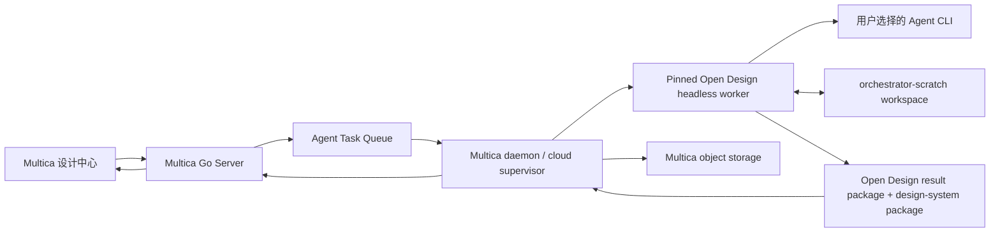

# Open Design 引擎接入与迁移方案

> 状态：`confirmed`
> 日期：2026-07-31
> 当前范围：设计体系创建、调整、预览和保存
> 上游基线：`open-design-v0.16.1` / `276b4d8e970bc143d7ad060181a89a834e3d9caf`

本文是 `P-009` / `DC-037` 的目标技术方案。它替代 Multica 参考 Open Design 后自行实现生成、Token 推导、组件识别、Package Audit 和 UI Kit 的路线，但不改变 Multica 已确认的 Project、Issue、Agent、草稿和保存产品语义。

## 1. 目标与非目标

### 目标

- 直接运行固定版本的 Open Design 设计体系引擎和 Agent workspace 流程；
- 由 Multica 继续选择执行 Agent、创建任务、记录过程、保存云端资产并展示设计体系；
- 本地仓库和云端仓库使用同一个任务协议，只改变 worker 的部署位置；
- 设计体系产物保持 Open Design 原始包结构，不再压缩成 Multica 自定义的固定三文件结果；
- 每次任务能够证明使用了什么输入、哪个 Agent、哪个 Open Design 版本以及产生了什么包。

### 非目标

- 不把 Open Design 的 TypeScript 引擎移植为 Go；
- 不复制 Open Design 的桌面端、本地 Project 列表或审批界面；
- 不让 Open Design 负责源码 checkout、PR、部署或外部仓库写回；
- 不在本阶段接入设计稿生成、设计还原、社区模板和 Figma UI Kit 写回；
- 不以 Open Design run `succeeded`、Multica task `completed` 或文件存在作为产品成功依据。

## 2. 固定版本与交付形态

第一接入基线固定为官方稳定 Release：

| 项目 | 固定值 |
| --- | --- |
| Release | `open-design-v0.16.1` |
| Commit | `276b4d8e970bc143d7ad060181a89a834e3d9caf` |
| 发布时间 | 2026-07-23 |
| License | Apache-2.0 |

Multica 不跟随 Open Design `main`。CI 从固定提交构建两种同源产物：

1. 供本地 Multica daemon 启动的 headless worker bundle；
2. 供云端隔离 worker 使用的 OCI image。

两种产物必须记录源码提交、依赖锁摘要和最终制品 SHA-256。Multica 仓库只保存版本清单、协议和适配代码，不把完整 Open Design 源码复制进当前 monorepo，也不要求用户安装 Open Design 桌面应用。

上游稳定版本由 `apps/packaged/package.json` 和发布脚本定义；同一标签中的根包、daemon、desktop 等 workspace 可能保留不同版本号。Multica 不使用任一子包的 `package.json` 作为运行身份，唯一可信身份是 Release Tag、Git commit 和构建制品 SHA-256 三元组。

升级上游必须单独完成：源码差异审查、协议契约测试、固定样例任务、Package Audit、Preview/UI Kit 视觉验收和回退演练。升级未通过前继续使用旧制品，不允许通过 `latest` 静默更新。

## 3. 目标架构



### Multica Go Server

继续负责：

- workspace、Project、Issue、用户和权限；
- 用户所选 Agent 的可用性与资源归属；
- `agent_task_queue`、任务取消和状态广播；
- 输入快照、draft/saved 槽位和原子保存；
- 对象存储索引、内容摘要和 Design Context Resolver；
- 设计中心 API，不直接执行 Open Design 内部逻辑。

### Multica daemon / cloud supervisor

它是唯一的运行时适配层：

- 校验任务所选 Agent 能否映射到 Open Design `RuntimeAgentDef`；
- 准备隔离 scratch workspace 和来源快照；
- 启动或连接固定版本 Open Design worker；
- 调用上游 HTTP API、消费 SSE、转发取消；
- 收集 result package、设计体系 archive、audit 和 preview 结果；
- 上传云端对象存储，并向 Server 回传不含本地绝对路径的结果。

### Open Design headless worker

直接负责：

- 来源采集、品牌 Seed 和确定性 Token/资产推导；
- Open Design design-system package 的创建、导入和丰富文件生成；
- 通过上游 Agent adapter 启动用户选定的 Agent CLI；
- Agent workspace 中的语义深化、调整和文件维护；
- 上游 Package Audit、Preview/UI Kit 和 artifact manifest；
- 原生 run 状态、事件流、取消和 `open-design.run-result-package.v1`。

Open Design worker 是执行引擎，不是第二套业务控制面。其内部 Project 只代表一次可丢弃的执行工作区，不成为 Multica Project 实体。

## 4. 本地与云端执行

### 本地仓库

Multica daemon 在项目资源所属机器启动 headless worker。daemon 从本地仓库准备只读来源快照或独立 scratch 副本，Open Design 与 Agent 只写 scratch，不直接修改用户仓库。Server 永远不会把本地绝对路径当作云端可访问路径。

### 云端仓库或云端材料

云端 supervisor 在隔离容器中按固定 ref 准备 checkout 和参考资料，再启动同一版本 worker。仓库凭据、分支选择和 checkout 由 Multica 管理，不能进入 Open Design 的长期存储或结果包。

两种场景均使用 Open Design 官方 `orchestrator-scratch` provenance：

```json
{
  "baseDir": "/runtime/task-123/workspace",
  "importedFrom": "folder",
  "orchestratorWorkspace": {
    "kind": "scratch",
    "sourceLabel": "multica-project:crm",
    "sourceRef": "main@abc123",
    "baseRevision": "abc123",
    "writeback": "external"
  }
}
```

这些字段只描述来源，不授予写回外部仓库的权限。

## 5. 一次任务的完整流程

### 5.1 创建任务

1. 用户在项目“设计体系”中选择 Agent、平台并提交背景和参考资料；
2. Server 固化输入快照并创建 Multica task；
3. task 同时记录 Open Design 固定版本、Agent 映射目标、来源摘要和预期操作；
4. Agent 或项目资源不可访问时在派发前失败，不静默改用其他 Agent。

### 5.2 准备 workspace

1. daemon 创建本次任务专属目录；
2. 按来源权限复制仓库快照、品牌资料、Figma 导入物和其他附件；
3. 为每个输入写入相对路径、来源类型、摘要和 checksum；
4. 写入 `orchestrator-scratch` metadata；
5. 记录源仓库基线，任务结束后确认源仓库没有变化。

### 5.3 Open Design 确定性处理与 Agent 深化

1. 调用 Open Design 创建或导入设计体系，先运行来源采集、Brand Engine 和确定性资产推导；
2. 创建 Open Design design-system workspace；
3. 使用所选 Agent 对应的上游 adapter 发起正常 Agent run；
4. Agent 阅读来源证据，深化 `DESIGN.md`、`tokens.css`、组件 fixture、预览、资产和使用说明；
5. 调整任务从当前有效包的 scratch 副本开始，不直接改云端 saved 包。

不能只调用 `/api/design-systems/generation-jobs` 就宣称完成。该 job 在 `v0.16.1` 主要负责确定性创建和步骤记录，模型语义深化发生在 Agent workspace 中。

### 5.4 事件和取消

daemon 持续消费 `/api/runs/:id/events`，按原始序号映射为 Multica 任务事件。页面只展示能够由事件证明的状态：workspace 已准备、Agent 已启动、文件变更、Package Audit、Preview 验证和终态；不根据本地计时伪造百分比。

用户停止任务时，daemon 调用 `/api/runs/:id/cancel`，等待 Open Design 给出终态后再清理 workspace。进程被杀死、SSE 断开和用户取消必须是不同失败原因。

### 5.5 收集与验证结果

Open Design run 结束后依次执行：

1. 获取 `/api/runs/:id/result-package`；
2. 校验 schema 必须为 `open-design.run-result-package.v1`；
3. 从 result package 声明的 scratch workspace 按 manifest 收集完整包；OD-owned 文件可以使用上游 archive/static-file API，但不能假设 result package 本身包含 archive；
4. 调用固定版本上游 Package Audit；
5. 在隔离环境加载 manifest 声明的 Preview/UI Kit，验证资源、尺寸和非空渲染；
6. 生成内容摘要和对象索引后上传 Multica 对象存储；
7. 只有 audit 与 preview 均通过，Server 才写入 draft 槽位。

`result-package` 是 run 与 provenance 的稳定信封，不等于完整设计体系 archive；两者必须关联保存，不能互相替代。

### 5.6 保存与放弃

- “保存为项目设计体系”只把已验证 draft 原子复制为 saved；
- 保存失败时旧 saved 继续有效，draft 保留；
- 放弃调整只删除 draft，不影响 saved；
- task 完成、Agent 自评或 Open Design run 成功都不得自动执行保存。

## 6. Multica 适配协议

Multica 与本地/云端 supervisor 使用自己的薄协议；该协议只编排上游，不重新描述 Open Design 的内部包规则。

### Run request

```json
{
  "schema": "multica.open-design-run/v1",
  "task_id": "uuid",
  "workspace_id": "uuid",
  "project_id": "uuid",
  "design_system_id": "uuid",
  "operation": "generate",
  "engine": {
    "release": "open-design-v0.16.1",
    "commit": "276b4d8e970bc143d7ad060181a89a834e3d9caf"
  },
  "agent": {
    "multica_agent_id": "uuid",
    "adapter_id": "codex",
    "model": null
  },
  "input": {
    "platform": "web",
    "brief": "...",
    "references_manifest": "input/references.json",
    "base_package": null
  },
  "workspace": {
    "kind": "scratch",
    "source_ref": "main@abc123",
    "base_revision": "abc123",
    "writeback": "external"
  }
}
```

`operation` 第一阶段只允许 `generate | adjust | regenerate`。`adapter_id` 必须来自 Open Design 固定版本的 adapter registry，并由 Multica Agent runtime 明确映射，禁止按名称猜测。

### Result

```json
{
  "schema": "multica.open-design-result/v1",
  "task_id": "uuid",
  "open_design_run": {
    "id": "run-id",
    "result_package_schema": "open-design.run-result-package.v1"
  },
  "package": {
    "manifest": {},
    "artifact_index": [],
    "archive_object_key": "design-systems/.../package.zip",
    "content_digest": "sha256:...",
    "audit": {}
  },
  "preview": {
    "status": "passed",
    "receipt": {}
  }
}
```

Server 只接受与当前 active task、engine commit 和 workspace provenance 完全匹配的结果。结果不得包含本地绝对路径、仓库凭据或未在 manifest 中声明的外部文件。

## 7. 模块处理矩阵

| 能力 | Open Design `v0.16.1` 来源 | 处理方式 | Multica 责任 |
| --- | --- | --- | --- |
| 包 schema、Token schema、派生输出 | `design-systems/_schema/`、`packages/contracts/src/design-systems/` | 直接复用 | 只保存版本和结果 |
| 多来源导入与证据 | `apps/daemon/src/design-systems/import.ts`、`source-context.ts`、GitHub/shadcn import | 直接复用 | 准备授权后的来源快照 |
| Brand Seed 与确定性推导 | `apps/daemon/src/brands/engine/` | 直接复用 | 传入材料，不重写算法 |
| Agent 检测、启动、流式事件和取消 | `apps/daemon/src/runtimes/` | 直接复用 | 把 Multica Agent 映射为 adapter id |
| Agent workspace 深化 | Open Design Project/run/skill 流程 | 直接复用 | 创建 scratch provenance 与任务关联 |
| Package Audit | manifest guard、package quality、Token/派生缓存检查 | 直接复用并加调用包装 | 只消费结构化结果 |
| Preview/UI Kit | design-system preview/showcase/static APIs | 直接复用 | 加云端鉴权、sandbox 和渲染回执 |
| Run/SSE/result package | `/api/runs/:id`、events、cancel、result-package | 直接复用 | 事件桥接、持久化和错误映射 |
| Project、Issue、Agent、权限 | 无 | Multica 保留 | Go Server 是唯一控制面 |
| draft/saved 与原子保存 | 无 | Multica 保留 | 只有用户操作可保存 |
| 对象存储与多租户隔离 | 无 | 薄适配 | Server 生成隔离 object key 与授权 URL |
| 设计中心内容主视图 | Open Design 仅提供内容和预览参考 | Multica 保留 | 继续使用已确认的项目 Tab 和产品语言 |
| 模板与社区资源 | plugin/catalog 协议 | 延后直接接入 | 第一阶段不建平行模板模型 |

### 当前 Multica 代码去向

| 当前模块 | 目标处理 |
| --- | --- |
| `server/internal/handler/project_design_system*.go` | 保留权限、任务、draft/saved 和 API；把固定三文件 completion 改为 worker result 接入 |
| `server/internal/projectdesignsystem/*.go` | 自定义 Markdown、CSS、HTML 解析和固定包校验逐步淘汰；不再扩展 |
| `server/internal/daemon/project_design_system_artifacts.go` | 固定读取三文件的 collector 由 Open Design result/archive collector 替代 |
| `server/internal/service/design_context_resolver.go` | 保留统一入口，改为读取已保存 Open Design 包及摘要 |
| `project-design-system-create.tsx` | 保留用户流程，提交到新的 engine adapter |
| `project-design-system-workspace.tsx`、task activity | 保留控制面，展示真实上游事件 |
| `project-design-system-canvas.tsx` | 保留章节导航和调整入口；自定义 Token 推导/固定内容渲染由上游 package/preview 数据替代 |
| `project-design-system-preview.tsx` | 保留安全 iframe、域名约束和回执；预览源改为上游声明产物 |
| `packages/core/types/design.ts`、API client | 适配通用 package manifest、artifact index、engine provenance 和 result 状态 |

## 8. 持久化边界

第一阶段继续维持“一项目一套体系、draft/saved 两槽位”，不提前增加 Open Design 的审批 revision UI。

`project_design_system` 继续保存身份、项目归属、当前 Agent、active task、输入快照和 saved 时间。package 存储目标从固定正文列转为：

- `engine_release`、`engine_commit`；
- Open Design `manifest.json`；
- 完整包 object key 与 artifact index；
- Open Design result-package 摘要；
- audit report、preview receipt 和 content digest；
- source task、Agent、instruction 和 scope。

完整文件进入对象存储，数据库只保存可查询元数据和核心事实摘要。当前 `design_md`、`tokens_css`、`components_html` 列在兼容期保持可读，但新引擎不能继续依赖它们表达完整包；消费者切换完成后再单独删除。

## 9. 分阶段迁移

### Phase 0：固定版本集成验证

不改用户主流程，先完成一个可丢弃的技术 spike：

1. 从固定提交构建 headless worker；
2. 通过 Multica daemon 准备 `orchestrator-scratch` workspace；
3. 显式选择一个现有 Multica Agent 并映射到上游 adapter；
4. 用 CRM 的同一份来源材料跑创建与一次调整；
5. 收集 SSE、result package、完整设计体系包、audit 和 preview；
6. 证明源仓库未被修改，并清理 scratch。

通过标准见第 10 节。未通过前不写数据库迁移，也不替换当前 UI。

### Phase 1：运行时与云端包接入

- 实现 supervisor 薄协议、worker 生命周期和制品校验；
- 将 Open Design 事件映射到现有 Agent task；
- 增加通用 package object/index 持久化；
- 在 feature flag 下写入 draft，仍不自动保存；
- 保留旧读取路径作为回退，不允许双写后静默选取质量较差结果。

### Phase 2：切换设计体系创建与调整

- 设计中心创建、重新生成和调整切换到 Open Design worker；
- 内容主视图改读 Open Design manifest、章节、Tokens 和 Preview/UI Kit；
- 浏览器实际验证首次创建、局部调整、取消、失败恢复、保存和放弃；
- 对同一输入执行新旧链路对比，只以产物和视觉结果判断切换。

### Phase 3：清理自研引擎

- 停止创建固定三文件 package；
- 删除自定义 Markdown/Token/HTML 解析和固定 artifact collector；
- 清理旧 API 字段和兼容数据库列；
- 保留安全渲染、任务、存储和 Design Context Resolver；
- 在删除前通过调用面、数据和回退演练确认无消费者。

### Phase 4：后续能力

设计体系闭环稳定后，再按上游协议分别接入模板、社区资源、UI 设计任务和设计还原。本阶段不为它们预先增加数据模型。

## 10. Phase 0 验收标准

Phase 0 只有同时满足以下条件才算通过：

1. worker 报告的 Release、commit 和制品摘要与固定清单一致；
2. 任务使用用户选择的 Multica Agent，能从事件和 run result 中核对 adapter/Agent 身份；
3. 确定性来源处理和 Agent workspace 深化都真实执行，不能只有 generation job；
4. 结果包含合法 Open Design 最小包，并按真实来源产生可选丰富文件；
5. 上游 Package Audit 通过，派生文件与事实源一致；
6. Preview/UI Kit 能在隔离浏览器中加载，核心资源非空且无越界访问；
7. 取消、Agent 失败、audit 失败和 preview 失败能得到不同终态，坏结果不会成为 draft；
8. 源仓库前后摘要和 `git status` 一致，scratch 可回收；
9. spike 能输出一份可归档证据包，包含输入摘要、事件、result package、完整 archive 和 content digest；
10. 同一任务可由这些记录复盘，不依赖 Open Design 桌面应用的本地状态。

### 10.1 当前验收矩阵

截至 2026-08-04，`OD-021` 至 `OD-027` 已覆盖 Phase 0 计划中的正向创建、真实调整、取消、Agent 失败、Package Audit 失败、Preview 失败和 scratch 回收；`OD-028` 至 `OD-036` 已把固定制品、持久 Run、archive、Audit、Preview、draft、有界 SSE 恢复和统一证据下载串成正式 Supervisor 门禁；`OD-037` 完成了固定真实 worker、实际对象存储和所选 Agent 的正式正向闭环；`OD-038` 至 `OD-041` 依次闭合了正式取消、Agent 失败、Audit 失败和 Preview 失败；`OD-042` 闭合了 worker 硬重启后的 Run 404、持久失败收敛、孤儿进程清理和确定性证据下载；`OD-043` 最后在同一正式正向 Run 中绑定 29 个 CRM 仓库来源文件和 28 条结构化事实，并证明源仓库零修改。Phase 0 的十项验收条件至此全部闭合；设计中心 archive-backed 展示属于 Phase 2 产品切换任务，不再作为 Phase 0 引擎验证缺口。

| # | 验收条件 | 证据 | 当前状态 | 未闭合缺口 |
| --- | --- | --- | --- | --- |
| 1 | 固定 Release、commit 和制品摘要 | `OD-021`、`OD-028`、`OD-042`、`OD-043` | 通过 | 正式 Run 持久化并重复核对 `open-design-v0.16.1`、固定 commit、lockfile 和 dist digest；真实重启还证明 worker 必须显式携带匹配的 Node runtime。外部制品准备和进程托管是下一阶段部署约束，不影响本项身份门禁结论。 |
| 2 | 用户选择的 Multica Agent 与 adapter 身份可核对 | `OD-022` 至 `OD-025`、`OD-028`、`OD-037`、`OD-039` 至 `OD-043` | 通过 | 正式正向、仓库正向和三类失败 Run 均核对用户所选 Agent、`opencode` adapter、binary、模型探测和插件策略；事件证明主 Agent 真实读取任务上下文并执行。 |
| 3 | 确定性来源处理和 Agent 深化均真实发生 | `OD-022`、`OD-023`、`OD-028`、`OD-037`、`OD-043` | 通过 | `OD-043` 在同一正式 Run 中携带 29 个 CRM 来源文件、28 条结构化事实和固定仓库 commit，Agent 读取后生成来源化规则、Preview 和 UI Kit，来源处理与 Agent 深化均有持久事件和归档证据。 |
| 4 | 产出合法最小包和有来源的丰富文件 | `OD-022`、`OD-023`、`OD-029`、`OD-030`、`OD-037`、`OD-043` | 通过 | 仓库正向 Run 通过实际对象存储归档 24 项原生产物，包括最小事实包、6 张 Preview、4 组 JSX/JS 组件和模块化 UI Kit，并生成上游 handoff 与 manifest。 |
| 5 | Package Audit 通过且派生文件一致 | `OD-022`、`OD-023`、`OD-026`、`OD-032`、`OD-037`、`OD-040`、`OD-043` | 通过 | 仓库正向 Run 的正式 Audit 检查 48 个文件并以零 error、零 warning 通过；正式负向 Run 又在真实 Agent 正常结束后以唯一 `missing_required_file` error 拒绝候选并持久化 digest 绑定回执。HTTP `2xx` 和 Agent `succeeded` 均不能代替 Audit 结果。 |
| 6 | Preview/UI Kit 在隔离浏览器中可见且资源安全 | `OD-022`、`OD-023`、`OD-027`、`OD-033`、`OD-037`、`OD-041`、`OD-043` | 通过 | 仓库正向 Run 的 6 张 Preview 和 1 个 UI Kit 共 7 个声明目标均由独立 Chrome 验证可见，合计零资源失败、零外连请求和零控制台错误；正式负向 Run 又以 `computed_visibility_hidden` 拒绝 DOM 存在但不可见的 UI Kit。 |
| 7 | 取消和三类失败具有独立终态，坏结果不成为 draft | `OD-024` 至 `OD-035`、`OD-038` 至 `OD-041` | 通过 | 正式真实 worker 取消已收敛为 task `cancelled`、Run `canceled`；正式 Agent 进程失败收敛为 `agent_failed`；Agent 正常结束后的 Audit 和 Preview 拒绝分别收敛为 `audit_failed` 与 `preview_failed`。四条负向路径均清理 active task，且未产生或覆盖 draft。 |
| 8 | 源仓库零修改且 scratch 可回收 | `OD-022` 至 `OD-027`、`OD-031`、`OD-042`、`OD-043` | 通过 | 仓库正向 Run 前后复核 HEAD、未暂存 diff、暂存 diff 和上下文文件四项摘要完全一致；正式 daemon 已持久化 scratch GC 身份，worker 重启后的孤儿 Agent 也已显式识别并清理。 |
| 9 | 输出完整可归档证据包 | `OD-022` 至 `OD-043` | 通过 | 各正式正向与负向 Run 均可下载统一 ZIP；`OD-043` 两次下载均为 111,322 bytes，SHA-256 同为 `d797a30a...aa04c`，且包含原始 archive、Audit、Preview、事件与来源输入。 |
| 10 | 记录可跨 worker 生命周期复盘 | `OD-025`、`OD-028` 至 `OD-036`、`OD-042` | 通过 | 新 worker 不重新装载旧 Run，旧 ID 返回 404；Multica 仍使用中断前持久事件和 Run 身份收敛为 `open_design_worker_run_missing`，并可在新 worker 内存状态为空时下载确定性证据，不会伪装原生续跑。 |

### 10.2 Go/No-Go 结论

- **引擎可行性：已证明。** 固定版本可以 headless 运行，真实 Agent 可以在 `orchestrator-scratch` 中创建和调整设计体系，Audit、Preview 和回收边界均有真实证据。
- **Phase 0 验收：Go。** `OD-037` 证明正式正向闭环，`OD-038` 至 `OD-041` 证明完整失败矩阵不会产生或覆盖 draft，`OD-042` 证明 worker 硬重启可观测失败和跨生命周期复盘，`OD-043` 又在同一正式正向 Run 中闭合仓库来源输入、源仓库零修改、零告警 Audit、离线 Preview/UI Kit、隔离 draft 和确定性证据归档。十项验收条件均已有真实证据。
- **允许的下一步：** 固化固定 worker 的部署托管，并在 feature flag 下进入 Phase 2 的 archive-backed 设计中心读取与真实浏览器切换验收。Go 不代表自动保存 draft、迁移旧数据或立即删除旧读取路径；这些动作仍需各自门禁和回退演练。

### 10.3 最小闭环任务与依赖顺序

1. **运行身份与派发 preflight**：为固定 worker 制品生成并持久化 Release Tag、commit、lockfile 和 dist digest；显式校验所选 Agent 的 adapter、binary、认证和模型；明确关闭或允许默认场景插件。
2. **Supervisor 持久执行记录**：在 worker 退出前保存输入快照、Agent/adapter 身份、SSE、终态、错误分类、result package、archive 和 content digest；任务查询与复盘不得依赖 worker 内存或重启后的 Run API。
3. **Audit、Preview 与 draft 串行门禁**：Run 成功后依次收集包、读取 `audit.ok`、执行独立 Preview verifier；只有三步全部成功才允许创建 draft。任一步失败都保留最近一次 saved，且不得产生或覆盖可用 draft。
4. **生命周期与恢复策略**：实现取消、进程终止、证据归档和 scratch 幂等回收；对 `missing_cursor` 明确采用可观测策略，不能把“同一 scratch 上新建 Session”伪装成原生恢复。
5. **自动化重跑矩阵**：在 feature flag 下重跑创建、调整、取消、Agent 失败、Audit 失败、Preview 失败、worker 重启复盘和源仓库零修改，并以持久终态、包摘要和真实浏览器结果决定 Phase 0 是否转为 Go。

`OD-028` 至 `OD-036` 已完成任务 1 至任务 4 的正式 Supervisor、持久证据和失败门禁；`OD-037` 跑通正向路径，`OD-038` 至 `OD-041` 跑通完整失败矩阵，`OD-042` 跑通 worker restart，`OD-043` 补齐仓库来源输入与源仓库零修改的正式正向证据。Phase 0 已转为 Go。下一有界批次不再扩展 spike，而是把固定 worker 的部署托管和 archive-backed 设计中心读取作为明确的后续阶段；在新读取链路完成真实浏览器验收前，不切换保存接口或清理现有回退路径。

## 11. 已知风险与约束

### 上游 API 稳定性

Open Design 已提供 external orchestrator workspace 和 result package v1，但设计体系 generation/audit 的全部能力尚未形成单一稳定远程 API。`v0.16.1` 的 Package Audit 主要由 TypeScript guard 和可调用函数组成，部分 guard 仍绑定上游仓库目录。第一阶段允许在固定 worker 内增加只负责参数化 package root、调用原 guard 并返回结构化结果的窄 endpoint；不得复制规则到 Go，也不得维护第二套检查标准。

### Agent 映射

Open Design adapter id 与 Multica Agent identity 不是同一个概念。必须建立显式映射和 preflight；上游不支持的 Agent 应拒绝任务，而不是换模型或换 Agent。

### 不可信预览

设计体系包可能包含 HTML、CSS、字体和图片。Multica 继续负责 CSP、iframe sandbox、允许域名、资源大小和浏览器渲染回执。直接采用引擎不等于信任所有生成内容。

### 本地数据与凭据

本地绝对路径、Agent CLI 凭据和仓库凭据只存在于运行机器。上传云端的 result 必须去除这些值，并以相对来源和摘要表达 provenance。

### 社区资源许可证

Open Design 本体为 Apache-2.0，不代表其所有社区包都可被 Multica 云端分发。模板和社区资源接入前必须单独建立来源、许可证、版本和撤回策略。

## 12. 明确禁止的回退路线

- 不再让 Agent 一次性输出 Multica 自定义 `DESIGN.md + tokens.css + components.html` 后自行校验；
- 不把 Open Design 包先转换成固定三文件再存储；
- 不用 Go 重写 Brand Engine、Token schema、组件提取或 Package Audit；
- 不让 Open Design 直接修改用户源仓库；
- 不复制 Open Design 桌面 UI 或 pending review 产品语言；
- 不因 worker 接入困难而静默恢复旧 Prompt 流程。
