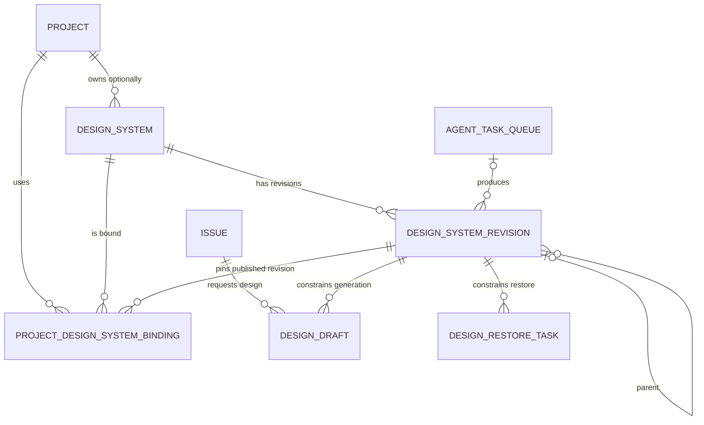

# Open Design 契约到 Multica 的最小落地映射

> 状态：`paused`
> 日期：2026-07-28
> 范围：保留的后续技术研究，不是当前产品目标，也不得直接作为实施计划

> 2026-07-28 修正：本方案过早把 revision、binding、包审计和 Agent 消费设为第一阶段。当前第一阶段以项目设计体系的创建、可视化、审核调整和保存闭环为目标，见 `P-008` / `DC-017`。只有该用户闭环验证成立后，才重新评估本文的技术模型。

## 1. 已确认前提

本方案受以下已确认决策约束：

- Multica 仍以 Project、Issue 和现有 Agent 控制面为主线，不复制 Open Design 的本地 Project 与 daemon；
- 第一版采用 Open Design 的设计体系基础契约，最小正式包为 `manifest.json`、`DESIGN.md`、`tokens.css`；
- 设计体系是事实源，在线 UI Kit 是派生视图，Figma UI 规范只是可选导入证据；
- Project 可以没有设计体系；只有已发布 revision 能成为主强约束；其他体系只能作为弱参考；
- 草稿或坏产物不能因为 Agent Task completed 就自动发布或绑定给 Project。

## 2. 当前实现与目标模型的差距

当前链路是：

```text
Figma UI 规范上传
  -> design_file / design_revision
  -> design_system_profile(status=analyzing)
  -> Local UI Restore Agent 输出 profile_json + recipe classifications
  -> design_system_profile(status=analyzed)
  -> design_component_recipe_set
  -> is_default=true 后直接成为项目约束
```

这套实现有四个根本限制：

1. `design_system_profile` 强制依赖一个 Figma `source_file_id` 和 `source_revision_id`，无法表达从零创建、多来源取证或独立的设计体系包；
2. `profile_json` 是可变结果，没有 `DESIGN.md + tokens.css` 双层事实契约，也没有可固定引用的正式 revision；
3. `analyzed + is_default` 把“Agent 分析成功”和“人工审核发布”混成了一件事；
4. UI Agent 生成目前被 `模板 Blueprint + RecipeSet + PageSpec` 绑定，这属于已暂停的 B 端语义编译实验，不是通用 Open Design 设计体系契约。

因此，不能通过继续扩展 `profile_json` 完成新方向。

## 3. 推荐的最小目标模型

目标模型只保留三个核心概念，不建立永久平行的第二套设计体系：

### 3.1 `design_system`

设计体系的稳定身份。建议由现有 `design_system_profile` 演进并最终改名，而不是长期同时维护两张逻辑主表。

最小职责：

- 归属 workspace；
- 可选记录创建它的 owner project；
- 保存名称、描述和归档状态；
- 指向当前已发布 revision；
- 不保存可变的 `profile_json`，不直接绑定某个 Figma 文件，也不承担 draft/published 内容状态。

### 3.2 `design_system_revision`

一次可审核、可固定引用的 Open Design 包快照。

最小字段语义：

```text
id
design_system_id
revision_number
parent_revision_id
status: draft | pending_review | published | rejected | archived
manifest_json
design_md
tokens_css
artifact_index
package_url / package_object_key
content_digest
audit_report
source_agent_task_id
created_by / reviewed_by / published_by
created_at / reviewed_at / published_at
```

存储规则：

- `manifest_json`、`design_md`、`tokens_css` 是数据库中可原子读取的最小事实包；
- `preview/`、`source/`、`assets/`、`fonts/`、UI Kit 和其他丰富文件放对象存储，由 `artifact_index` 记录路径、角色、类型、大小和 checksum；
- 可下载 zip 是该 revision 的分发形式，不是额外事实源；
- revision 进入 `pending_review` 后内容冻结；`published` 后永久不可变，修改必须创建下一 revision；
- `content_digest` 用于 Agent 上下文、缓存和任务复现。

### 3.3 `project_design_system_binding`

Project 对一个固定、已发布 revision 的使用关系。

最小字段语义：

```text
workspace_id
project_id
design_system_id
design_system_revision_id
role: primary | inspiration
position
created_by
created_at
```

约束：

- 每个 Project 最多一个 `primary`；
- `primary` 和 `inspiration` 都只能指向 `published` revision；
- 绑定必须固定 revision，不能只指向会移动的设计体系 head；
- 发布新 revision 不静默更新 Project，用户明确确认后才切换绑定；
- `inspiration` 只能提供风格倾向和模式参考，不能覆盖 primary 的 Tokens。

## 4. 实体关系



`未建立设计体系` 不需要一条占位数据，表现为 Project 没有 primary binding，也没有主动创建中的 design system。

## 5. 生命周期

```text
用户主动创建或导入来源
  -> design_system
  -> draft revision
  -> Agent 生成最小包和可选丰富文件
  -> Server package audit
  -> pending_review
  -> 人查看 DESIGN.md、Tokens、来源证据和在线 UI Kit
     -> reject: rejected，不影响现有 Project 绑定
     -> publish: published，可选择绑定为 Project primary
  -> 后续修改从 published revision 派生新的 draft
```

发布前至少验证：

- 三个最小文件存在且可解析；
- manifest 与 artifact index、checksum 一致；
- `tokens.css` 通过结构化 CSS/Token 校验，并标记 fallback、alias 和来源置信度；
- `DESIGN.md` 与 Tokens 的明显冲突进入 audit report；
- 在线 UI Kit 可渲染，并作为人工审核证据；
- Agent 的任务状态、摘要或自评分都不能替代以上产物验证。

## 6. UI Agent 的固定消费契约

Server 增加一个统一的 Design Context Resolver。UI 设计和设计还原都调用它，不能各自在 Handler 中读取“当前默认 profile”。

一次任务解析后应固定保存：

```text
primary_design_system_revision_id
primary_content_digest
inspiration_revision_ids[]
resolved_at
```

最小 Agent Pack：

```text
primary.manifest
primary.DESIGN.md
primary.tokens.css
primary.components.manifest.json（存在时）
primary.components.html 或 UI Kit 索引（manifest 不存在时按需读取）
primary.optional_artifacts[]（只给索引和鉴权 URL）
inspirations[]（摘要、允许借鉴范围、固定 revision；不注入其 Tokens 为强约束）
```

消费优先级分两类：

### UI Agent 设计稿生成

```text
Project primary published revision
  > 本地仓库已有 DESIGN.md（仅本地 Agent 可读，且只作辅助）
  > repository reality
```

模板、社区设计资源和 inspiration 是弱参考，Agent 可以借鉴布局与模式，但不得覆盖 primary Tokens。

### UI Agent 设计还原

```text
本次选中的设计稿 revision / frame / layer（视觉与内容事实）
  + Project primary published revision（Token、组件和缺失细节约束）
  > 本地仓库已有 DESIGN.md 和 repository reality（实现辅助）
```

设计体系不能反过来覆盖设计稿中明确存在的页面结构、文案和状态；发生冲突时必须记录差异，不能静默改图。

## 7. 与 Project、Issue 和执行记录的关系

- Project 通过 binding 获得长期设计上下文；Project 没有 binding 是合法状态；
- Issue 不复制设计体系正文，只通过设计任务或还原任务引用解析后的固定 revision；
- 第一阶段继续使用 `agent_task_queue` 作为 Agent 执行记录，不为设计体系生成单独新增一张 `design_run` 表；
- `design_system_revision.source_agent_task_id` 记录产出任务；任务 context 固定 base revision、来源快照和目标 revision；
- 现有 `design_draft.issue_id` 继续负责设计稿与需求的关联，后续增加固定的 `design_system_revision_id`；
- 现有 `design_restore_task` 后续增加同样的固定 revision 引用，不能只在派发时拷贝一个可失真的 `profile_json`；
- 设计任务发起器与通用 Design Run 仍是下一议题，本阶段不提前建模。

## 8. 现有能力的处理方式

### 保留

- `design_file`、`design_revision`、`design_asset` 和 Figma 插件上传；
- 现有 Agent Task 队列、会话、运行状态与接管能力；
- `design_draft` 的 Issue 关联、草稿审核、物化设计稿能力；
- 设计还原、MCP 和选中 frame/group/layer 的上下文能力。

### 改造

- Figma `UI 规范` 上传改为 design system revision 的来源证据，不再直接产生项目默认强约束；
- 设计中心的“UI 规范”入口改为“设计体系”，详情展示 revision、Tokens、来源、audit 和在线 UI Kit；
- Agent Prompt 从 `profile_json` 改为统一的、固定 revision 的 Agent Pack；
- `design_system_profile` 逐步演进为逻辑 `design_system`，旧字段完成迁移后删除。

### 暂停扩展

- `design_component_recipe_set`；
- `design_template_blueprint`；
- `PageSpec -> CompileListPage` 作为通用 UI 设计引擎；
- 强制要求 input、select、table、pagination 等固定 B 端 recipe kinds。

这些表和代码先不删除，以免破坏现有数据和已完成实验；但新设计体系流程不继续依赖它们。

## 9. 旧数据迁移原则

现有 `design_system_profile` 不能自动升级为已发布体系：

1. 保留原始 Figma `design_file / design_revision`；
2. 为每个 profile 建立对应 design system 身份；
3. 将原 profile、recipe、分析错误和来源引用装入一个 `draft` revision 的 `source/legacy/` 与 audit report；
4. 尝试从真实来源生成 Open Design 最小包，但只进入 `pending_review`；
5. 不把旧 `is_default` 自动转换成 primary binding；用户审核发布后再显式绑定；
6. 迁移完成并验证消费者切换后，再移除旧 `profile_json / is_default / source_*` 语义。

这样会短期存在兼容读路径，但目标模型只有一套，不形成永久双轨。

## 10. 建议的第一实现切片

第一实现切片只做：

1. 设计体系身份、revision 和 Project binding 数据模型；
2. Open Design 最小包的保存、读取、audit、待审核与发布；
3. 设计中心的未建立、草稿审核、已发布三个核心状态；
4. Figma UI 规范作为一个来源导入到 pending revision；
5. 统一 Design Context Resolver，并先接入一条可验证的 UI Agent 消费链。

不在第一切片做社区模板、完整在线编辑器、原生 Figma 写回、通用 Design Run 或旧语义编译器重写。

## 11. 已确认的产品选择

1. 发布新 revision 后，Project 必须由用户明确确认升级绑定，不自动追随最新版；
2. owner project 创建的第一个 revision 发布时，主操作表达为“发布并设为项目主体系”；
3. 旧 `is_default` 数据全部进入待审核，不为兼容而自动发布或自动绑定。
