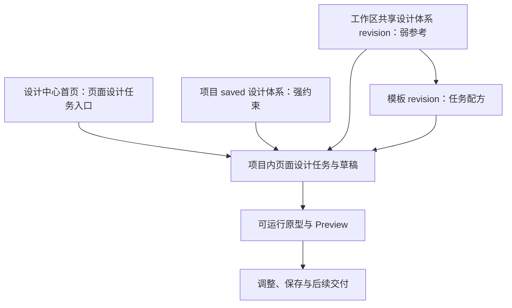

# 设计中心首页、共享设计体系与社区模板产品方案

> 日期：2026-08-12
>
> 状态：`confirmed`
>
> 当前实施边界：只有首页页面设计任务入口进入新 Phase A；共享设计体系和模板按后续独立切片推进

## 1. 决策摘要

Multica 设计中心依次建设五个产品切片：

1. 新 Phase A：设计中心首页页面设计任务入口；
2. Slice B：工作区共享设计体系资源库；
3. Slice C：官方模板目录；
4. Slice D：工作区成员模板发布；
5. Slice E：跨工作区社区模板。

五个切片共享统一的任务上下文和不可变引用原则，但不是一个同时实施的大功能。首页任务入口先证明用户可以从自然语言需求进入真实项目，使用真实 Agent、项目上下文和已保存设计体系生成页面设计草稿或可运行原型。共享设计体系和模板随后作为首页的可选参考资源加入。

## 2. 产品关系



项目设计体系、共享设计体系、模板和模板应用快照必须保持为不同概念：

| 概念 | 职责 |
| --- | --- |
| Project design system | 当前项目已保存的设计事实源，是页面设计任务的强约束 |
| Published design-system resource | 经过安全剥离的不可变共享视觉参考 |
| Template resource | 某类页面设计任务的可执行配方和默认上下文 |
| Applied template snapshot | 某次任务实际使用的模板、设计体系引用和用户输入快照 |

不得用一个 `is_public` 字段或一个旧 template 实体同时承载这些语义。

## 3. Slice A：设计中心首页页面设计任务入口

### 3.1 产品定位

首页是跨项目的页面设计任务发起器，不是无项目画布，也不创建第二套 Project。第一版只生成项目内页面设计稿或可运行原型，不从首页创建设计体系，也不自动判断用户想设计页面还是设计体系。

### 3.2 首页结构

首页第一版包含：

1. 主输入区：自然语言页面设计需求，可附截图、参考设计或需求附件；
2. 紧凑上下文区：目标项目和执行 Agent 必选，目标平台可选；
3. 最近工作区：最近页面设计任务和草稿，展示项目、需求摘要、Agent、状态和更新时间。

在共享设计体系与模板切片尚未实施时，不显示假数据或不可用占位选择器。

### 3.3 提交流程

```text
自然语言需求
→ 选择项目与 Agent
→ 服务端固定输入快照
→ 创建项目内页面设计任务
→ 创建成功后打开或聚焦目标项目 Tab
→ 切换到“设计草稿”
→ 首页和项目 Tab 读取同一个服务端 task/draft
→ 完成后展示可运行原型与 Preview
```

提交失败时保留首页全部输入，不切换项目。创建成功后才导航，不做乐观创建或本地伪任务。

### 3.4 设计约束优先级

页面设计任务使用以下优先级：

```text
用户明确需求
+ 项目已保存设计体系（视觉强约束）
> 用户选择的工作区共享设计体系（弱参考）
> 模板绑定的推荐体系（更弱参考）
> 通用设计质量规则
```

项目 saved 体系自动进入任务上下文，不要求用户重复选择。弱参考和模板不能覆盖项目 Tokens，也不能隐式建立或替换项目设计体系。

### 3.5 第一版非目标

- 从首页创建设计体系；
- 无项目设计；
- 自动意图识别；
- 社区推荐信息流；
- 多模板或多共享体系混合；
- 页面生成后自动交付前端；
- 把旧 PageSpec 编译器设为默认页面设计引擎。

## 4. Slice B：工作区共享设计体系资源库

### 4.1 不可变发布快照

项目体系继续维护 `draft` 和 `saved`。拥有权限的用户从当前 `saved` 显式执行“发布到工作区资源库”，系统生成独立、不可变的共享 revision。项目后续调整不影响已发布 revision；更新必须显式发布新版本。

发布 revision 至少固定：

- 公开名称、说明、平台、分类和标签；
- 可共享的 `DESIGN.md` 规则与 Tokens；
- 组件清单和经 Audit 的 UI Kit/Preview；
- 发布者、版本、发布时间和 content digest；
- 经过安全剥离的来源类型摘要。

### 4.2 发布前安全剥离

服务端重新读取 saved Native V2 package、重新校验，并只复制允许共享的内容。默认剥离：

- 仓库路径、commit、内部 URL 和项目描述；
- input snapshot、task、Agent session、错误详情和 Evidence；
- 附件原始地址与鉴权资源；
- workspace/project 内部标识；
- 未明确授权共享的 Logo、字体和品牌资产。

剥离后 package 不完整或 Preview 资源缺失时，发布失败，不生成半公开 revision，项目 saved 不受影响。

### 4.3 第一阶段权限

第一阶段仅工作区共享：

- 工作区成员可发现和使用；
- 项目外成员不能回看来源项目；
- 发布需要项目编辑权限和工作区资源发布权限；
- 不引入待审核、通过、驳回等设计审核流；
- 下架只阻止新引用，历史任务继续读取固定 revision；
- 已被历史任务引用的 revision 不物理删除，只归档；
- 来源项目删除不影响已发布 revision。

后续才扩展到公司内共享和跨工作区社区共享。

### 4.4 首页引用与复制

首页可以选择一个工作区共享设计体系 revision 作为弱参考。任务创建时固定：

```text
resource_id
revision_id
content_digest
sanitized package snapshot
```

如果目标项目没有 saved 体系，用户可以选择：

- 仅本次参考：仍是弱参考；
- 复制到项目：创建项目设计体系 draft，用户查看并保存后才成为强约束。

选择共享体系不能隐式建立项目体系。

## 5. Slice C–E：模板与社区

### 5.1 模板定义

模板是页面设计任务配方，不是设计体系。模板可以包含：

- 适用场景和平台；
- 示例需求和推荐输入；
- 页面与交互目标；
- Agent 执行说明；
- 产物要求和示例 Preview；
- 可选的共享设计体系 revision；
- 版本、作者、许可和能力要求。

模板不能覆盖用户明确需求、项目 saved 体系、权限边界和 Native V2 的 Package Audit/Preview 门禁。

### 5.2 模板应用快照

用户在首页选择模板后仍需选择项目和 Agent，并可修改自然语言需求。提交时固定：

```text
template resource + revision
+ template manifest digest
+ selected project
+ user requirement
+ selected design-system revision
+ attachments
+ platform
= applied template snapshot
```

历史任务不读取模板最新版本。模板升级或下架不改变已经创建的任务。

### 5.3 Slice C：官方模板目录

第一阶段只允许平台管理的官方模板：

- 分类、标签和搜索；
- 卡片与详情 Preview；
- 固定 revision；
- 从首页应用；
- 可选绑定共享设计体系 revision；
- Audit 和安全检查。

不建设用户发布、举报、排行或完整 Marketplace。目标是验证模板是否提高任务发起效率和最终生成质量。

### 5.4 Slice D：工作区成员模板发布

工作区成员可以从成功设计任务或已保存设计资产显式发布模板。发布时生成独立 revision，剥离项目和任务私有信息，补充名称、说明、分类、示例需求和许可，并重新执行 Audit/Preview。

第一版禁止模板携带任意脚本、外部网络访问、可执行二进制或自由服务器命令。Agent 执行说明必须受当前 Agent 权限和任务沙箱约束。

### 5.5 Slice E：跨工作区社区模板

只有工作区发布经过真实使用验证后才进入社区阶段。社区阶段再建设：

- 跨工作区发现；
- 发布者与许可；
- 官方、社区和已验证标识；
- 举报、下架和封禁；
- 内容审核和恶意资源检查；
- 搜索、推荐、版本兼容和派生关系。

本阶段不属于新 Phase A，也不进入首页首轮实施计划。

## 6. 首页中的资源呈现顺序

首页始终以自然语言需求为主入口。能力逐步上线后，上下文区按以下顺序呈现：

1. 目标项目；
2. 执行 Agent；
3. 可选官方或工作区模板；
4. 可选工作区共享设计体系；
5. 最近工作。

官方和工作区模板在同一目录中明确标记来源。跨工作区社区模板未来使用独立社区浏览区，不把推荐信息流塞进首屏任务发起面。

## 7. 失败与历史稳定性

- 首页任务创建失败：保留输入，不创建半任务，不导航；
- 共享体系发布失败：项目 saved 不受影响；
- 共享体系或模板下架：新任务不可选，历史任务继续读取固定 revision；
- 来源项目删除：已发布 revision 独立保留；
- 发布者离开项目：资源归工作区管理，不自动删除；
- 复制共享体系失败：不产生项目体系或半 draft；
- 模板引用体系下架：新应用要求重新选择或移除引用；
- 模板与项目体系冲突：用户需求和项目 saved 体系优先，冲突进入应用快照供 Agent 解释；
- 模板或体系版本更新：不影响历史任务；
- 生成结果可渲染不等于质量通过，仍需真实产物和用户质量验收。

## 8. 与现有实现的关系

当前设计中心已经具备固定首页 Tab、项目 Tab、项目内容 Tab、项目列表、Agent 列表、项目设计体系、设计草稿和 workspace-scoped 模板目录。首页内容目前为空。

现有 `design_template_library`、`design_catalog_template` 和 `design_template_revision` 可作为迁移输入与部分基础，但不能直接视为社区资源模型。它们缺少共享发布快照、安全剥离、应用快照、许可和治理语义；旧 draft/approved/rejected 等历史流程也不能约束新的无审核产品语言。

新规格先定义资源、revision 和应用快照契约，再决定扩展现有表还是建立中性共享资源模型，不提前锁定数据库实现。

## 9. 与 Native V2 渐进清理的关系

每个切片遵守 [Native Design 产品切片演进与渐进清理方案](./2026-08-12-native-design-slice-driven-evolution-design.md)：

- 首页切片只清理页面任务入口内部已无调用的旧生成路径；
- 共享体系切片只清理体系发布、引用和复制范围内的旧 Profile fallback；
- 官方模板切片只清理模板应用范围内的旧 patch/PageSpec 路径；
- 跨切片编译器、历史模板表和数据进入退役账本，不扩大当前切片；
- 普通功能切片不删除历史行、对象、表或约束。

## 10. 阶段边界与当前进度

只有 Slice A 首页页面设计任务入口进入新的 Phase A。Slice B–E 是后续独立产品切片，不计入 Phase A 完成条件。

新 Phase A 因新增首页页面设计闭环，当前综合进度从先前估计的约 58% 调整为约 45%–50%，暂以 48% 作为讨论基线。这是产品范围估算，不是完成声明；在新 Phase A 的详细目标、证据和切片计划确认后应重新计算。

## 11. 后续更新

2026-08-12 的后续产品问答已经确认 Slice A 的完整页面 Design Document 闭环：产物采用 `multica.design-document/v1`，使用不可变 revisions、draft/saved 指针、任务内自动只读仓库 Grounding、持续智能体工作空间和现有本地浏览器强制门禁，并按 A1 至 A6 内部子切片实施。完整增量方案见 [Native Design Phase A：页面 Design Document 产品与技术方案](./2026-08-12-native-design-phase-a-design-document-design.md) 和 DC-042 至 DC-046。

本文件对 Slice B 至 E 的共享设计体系和模板分期继续有效。它们仍不进入 Phase A；先前约 48% 只是在 Design Document 方案确认前的讨论基线，不再作为当前进度。
